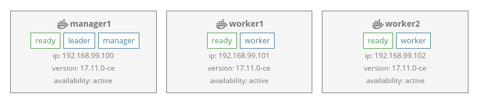

# The Imixs-Docker-Cloud

Imixs-Docker-Cloud is a conceptual infrastructure project, describing a way to create a Docker based server environment for business applications.
One of the main objectives of this project is to focus on **simplicity** and **transparency**. 

Imixs-Docker-Cloud is developed as part of the Open Source project [Imixs-Workflow](http://www.imixs.org) and continuous under development. 

The general idea is to setup a lightweight [docker](https://www.docker.com/) based infrastructure with [docker swarm](https://docs.docker.com/engine/swarm/). Within this infrastructure business applications like [Imixs-Office-Workflow](http://www.office-workflow.de) can be deployed in a fast and easy way. 

## Rules
The main objectives of this project can be itemized under the following rules:

 1. _A Imixs-Docker-Cloud can be setup easily and run on commodity hardware._
 2. _All services and infrastructure components are running on docker swarm._
 3. _The docker command line interface (CLI) is used to setup and manage nodes and services._ 
 4. _Docker UI Front-End components are used to monitor the infrastructure._
 5. _Business applications are deployed to a central Docker-Registry and started as services._
 6. _All services are isolated and accessible only through a central proxy server._
 7. _Scalabillity and configuration is managed by docker-compose._
 
 
## Basic Architecture

The basic architecture of the Imixs-Docker-Cloud consists of the following components:

 * A Docker-Swarm Cluster running on virtual or hardware nodes. 
 * A Management node providing a registry and a proxy server.
 * One ore many worker nodes to run the services. 
 * A central Reverse-Proxy service to dispatch requests (listening on port 80) to applications.
 * A management UI running on the management node.
 
 
## Nodes

A Imixs-Docker-Cloud consists of at least twoo nodes. One node is the  management node, the other is the worker node serving our applications. The management node is visible via the internet. Worker nodes are only visible internally in the swarm. The infrastructure can be scaled by adding new worker nodes. 

 
### Directories 
 
The management node has the following directory structure located in the manager home directory to setup and run the Imixs-Workflow-Cloud and its services. 

	/-
	 |- management/
	 |   - registry/
	 |   - swarmpit/
	 |   - traefik/
	 |- apps/

The /management/ directory holds the service configuration for the management services running on the management node only. 
The /apps/ directory contains service setups to start applications running on the worker nodes.

You can checkout this structure form the git repo or create the folders by your self. 
Each directory typically holds a docker-compose.yml file to startup the corresponding service and optional additional configuration files.   
 
 
# How to Setup

[Docker-Swarm](https://docs.docker.com/engine/swarm/) is used to run a cluster of docker hosts serving business applications in docker-containers.
Each node in the swarm has at least installed Docker.

Read the following sections to setup a Imixs-Docker-Cloud

 * [How to setup Imixs-Docker-Cloud](SETUP.md) - basic setup information.
 * [How to secure Imixs-Docker-Cloud](SETUP.md) - advanced setup and security information.

  
# Contribute

Imixs-Docker-Cloud is open source and are sincerely invited to participate in it. 
If you want to contribute to this project please [report any issues here](https://github.com/imixs/imixs-docker/issues). 
All source are available on [Github](https://github.com/imixs/imixs-docker).

