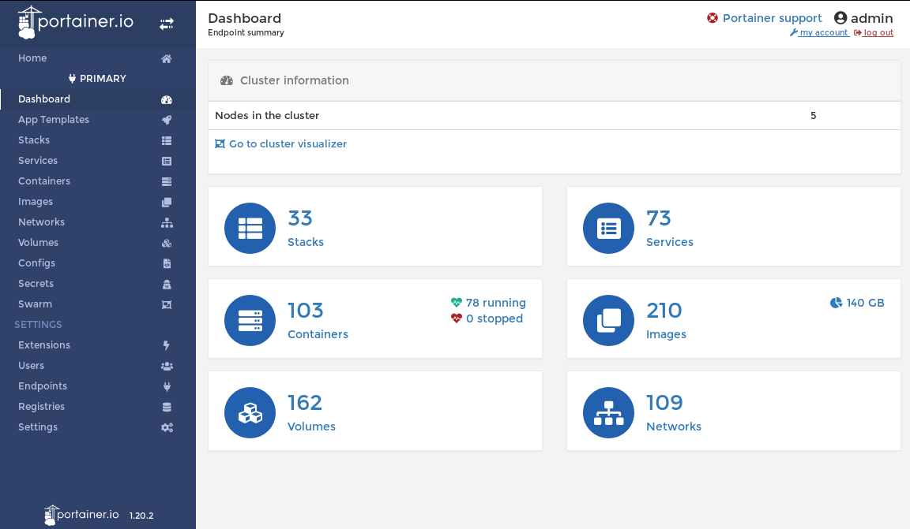

# The Imixs-Cloud

_Imixs-Cloud_ is an open infrastructure project, providing a lightweight [docker](https://www.docker.com/) based runtime environment for small and medium-sized organizations. This project is optimized to **build**, **run** and **maintain** business applications in a production ready cluster. The main objectives of _Imixs-Cloud_ are **simplicity**, **transparency** and **operational readiness**. 

The runtime environment is based on [Kubernetes](https://kubernetes.io/). Kubernetes is a powerful platform with no limits in scaling and flexibility. _Imixs-Cloud_ provides an easy way to setup and maintain a medium-sized kubernetes cluster environment hosted on virtual servers or bare metal.

**Note:** In our first version 

The project is open source and constantly under development. We sincerely invite you to participate in it!

## The Main Objectives
The main objectives of the _Imixs-Cloud_ project can be itemized under the following rules:

 1. _A new environment can be setup easily and run on commodity hardware._
 2. _A command line interface (CLI) is all you need to know to setup and manage the environment._ 
 3. _Scalabillity and configuration is managed by the core concepts of Kubernetes._
 4. _Docker Images can be deployed to a central Docker-Registry which is part of the environment._
 5. _All services are isolated and accessible through a central reverse proxy server._
 6. _The environment configuration can be managed by a private code repository like Git._
 7. _A terminal UI to interact with the Kubernetes clusters._
 
 
## Quick Start

For a quick setup you need at least a Debian 9 server with a public internet address and a user with sudo privileges.

1) from your users home directory first install git 

	   $ sudo apt-get install -y git 

2) clone the imixs-cloud repo from github....

	   $ cd && git clone https://github.com/imixs/imixs-cloud.git
	   $ cd imixs-cloud/

3) run the setup script on your master node to install Kubernetes
 
	   $ sudo ./scripts/setup.sh

 
4) initialize your Kubernetes cluster

	$ sudo kubeadm init --pod-network-cidr=10.244.0.0/16 --apiserver-advertise-address=[NODE_IP_ADDRESS]

Replace [NODE\_IP\_ADDRESS] with your servers public IP address. 

5) deploy a cluster network

	$ kubectl apply -f https://raw.githubusercontent.com/coreos/flannel/master/Documentation/kube-flannel.yml

6) run the setup script now on each of your worker nodes:

	$ sudo ./scripts/setup.sh

7) join your worker notes to your new cluster using the join command from your master node

	$ sudo kubeadm join xxx.xxx.xxx.xxx:6443 --token xxx.xxxxxxxxx  --discovery-token-ca-cert-hash xxxxxxxxxxxxxxxxxxxxxxxxxxxxxx 

 
**That's it! Your kubernetes cluster is ready**

You will find a more detailed description about how to setup your Kubernetes cluster  in the [setup section](doc/SETUP.md)

 
## Basic Architecture

The basic architecture of the _Imixs-Cloud_ consists of the following components:

 * A Kubernetes Cluster running on virtual or hardware nodes. 
 * One master node, providing central services.
 * One or many worker nodes to run your services and applications. 
 * A central Reverse-Proxy service to dispatch requests (listening on port 80).
 * A management UI running on the management node.
 * A private registry to store custom docker images.
 

 
## The Configuration Directory 
 
The complete infrastructure of a Imixs-Cloud environment is described in a central configuration directory. The _Configuration Directory_ can be synchronized with a code repository like Git. This makes it easy to setup the environment on a new manager node. The imixs-cloud directory contains different sub-directories holding your applications, scripts and tools:

	/-
	 |+ management/
	    |- monitoring/
	    |- registry/
	    |- traefik/
	 |+ apps/
	    |+ MY-APP/
	       |  001-deployment.yaml
	    .....
	 |+ scripts/
	    |  apply.sh
	    |  setup.sh
	    |  delete.sh
	 |+ tools/

 - **apps/** is the place where where your custom business services are configured. Each sub-directory holds at least one kubernetes object description (yaml file). Optional additional configuration files are also located in this directory. 

 - **management/** sub-folder holds the configuration for all management services running on your kubernetes cluster. This configuration is maintained by this project and can be customized for individual needs. 

 - **scripts/**  provides bash scripts to apply or delete an application and also the setup script to setup a kubernetes node.

 - **tools/**  provides useful tools

You can copy this structure from [GitHub](https://github.com/imixs/imixs-cloud) to setup and create your own _Imixs-Cloud_ environment. 
 
	$ git clone https://github.com/imixs/imixs-cloud.git && rm -rf imixs-cloud/.git/
	
Optional you can also fork the repo directyl on Github. 

### How to create and delete objects

You can define your own services within the /apps/ directory. Each application has its own sub-folder and consists at least of one configuration yaml file 

	 |+ apps/
	    |+ MY-APP/
	       |  001-deployment.yaml

Using the _kubectl apply_ command you can easily create or delete your services and objects defined within a apps/ or managment/ subdirectory:

	$ kubectl apply -f apps/MY-APP/

For example to deploy the traefik configuration you just need to call:

	$ kubectl apply -f management/traefik/
	
In kubernetes object configurations are typically defined in separate files. Use a naming convention to create an implicit order in which your objects should be created.

	 |+ traefik/
	    |- 001.crd-rbac.yaml
	    |- 002.deployment.yaml
	    |- 003.service.yaml

If you want to remove an already deployed service or object just use the delete command:

	$ kubectl delete -f management/traefik/

## Manage your Cluster using K9S

[K9s](https://github.com/derailed/k9s) is a powerful terminal tool to interact with your Kubernetes cluster. 

You can download the tool from the [release page on Github](https://github.com/derailed/k9s/releases). To install the tool on your home directory:

	# download and extract the latest version
	$ wget https://github.com/derailed/k9s/releases/download/0.12.0/k9s_0.12.0_Linux_x86_64.tar.gz
	$ tar xvzf k9s_0.12.0_Linux_x86_64.tar.gz

Now you can start the tools with

$ ~/k9s

## Helm 

Helm is a tool which helps you manage Kubernetes applications by so called Helm Charts. Helm Charts help you define, install, and upgrade even the most complex Kubernetes application.

To install helm run

	$ ./scripts/get_helm.sh

# How to Montior

_Imixs-Cloud_ also provides also a monitoring feature which allows you to monitor your docker-swarm.

  
  
The monitoring is based on [Prometheus](https://prometheus.io/) which is an open-source systems monitoring and alerting toolkit. You can use this monitoring service not only to montor your docker-swarm network but also to monitor specific application data. Read more about the monitoring feature [here](doc/MONITORING.md).
  
# Contribute

_Imixs-Cloud_ is open source and your are sincerely invited to participate in it. 
If you want to contribute to this project please [report any issues here](https://github.com/imixs/imixs-cloud/issues). 
All source are available on [Github](https://github.com/imixs/imixs-cloud).

