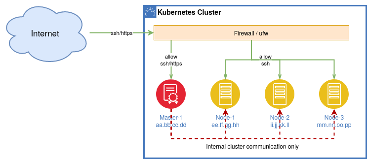
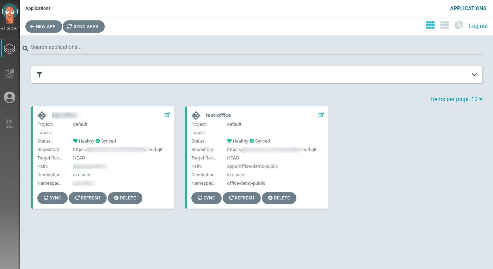

# The Imixs-Cloud

### Build Your Own Kubernetes Cluster!

[_Imixs-Cloud_](https://github.com/imixs/imixs-cloud) provides an open concept for small and medium-sized organizations to run an independent, stable and easy to manage cloud infrastructure.
This project is 100% open source and based on [Kubernetes](https://kubernetes.io/) - a cloud solution for automating deployment, scaling, and management of containerized applications.

You are sincerely invited to join this project on [Github](https://github.com/imixs/imixs-cloud). If you have any questions just start a new [Discussion on Github](https://github.com/imixs/imixs-cloud/discussions).

The flexible and sustainable concept allows you to run your cloud infrastructure without any vendor lock-in. Small and medium-sized cluster environments can be hosted on bare metal or virtual servers. You can setup your own _Imixs-Cloud_ Kubernetes Cluster within a few hours.

<p align="center"></p>

### Topics

- [The Architecture](#the-architecture)
- [Quick Start Guide](#quick-start-guide)
- [Management Services](#management-services)
- [How to Contribute](#how-to-contribute)

# The Architecture

Imixs-Cloud is based on a simple architectural idea.

- The separation of the Kubernetes cluster from an independent storage cluster - _Separation of Concerns_
- A fully declarative and versioned description of the target state in Git - _Infrastructure as Code_

In the following sections you will find a detailed setup guide.

## Kubernetes

In its core Imixs-Cloud runs one or many Kubernetes clusters. One cluster consists of the following components:

- One master node, providing the central services.
- One or many worker nodes running your services and applications.
- A central Reverse-Proxy service to dispatch requests from the Internet to your applications.
- A private registry to store custom docker images.
- A storage solution connecting the Cluster to a independent Ceph cluster.

You will find a detailed installation guide in the [setup section](doc/SETUP.md).

### The Network

Network is of course the most important part of a cloud environment. There are a lot of concepts and tutorials about how to setup the network for a Kubernetes. Most tutorials recommend that you use a second private network for the internal communication of your cluster nodes. But note: this only makes sense if your private network is notedly faster than your public network. If you do not have a separate network adapter you can run your cluster also with one public or private network only.

<p align="center"></p>

In case of a public network you just need to take care about firewall rules. If your _node to node communication_ is fast - 1GiBit or above - there's absolutely nothing wrong operating within a public network. In addition, a single network also reduces complexity, which is always an advantage. With a simple firewall script you can protect your cluster easily form being accessible from outside and allowing internal communication only. See also the section [Firewall](./doc/FIREWALL.md).

## The Data Layer

Of course, when you set up your own cloud infrastructure with [Kubernetes](https://kubernetes.io/), you need to take care of your servers and your data.
Kubernetes offers a well designed idea how to run a cluster on different nodes, providing a stable runtime environment for your containerized applications. These concepts are well documented and you will find a lot of tutorials about that. But Kubernetes does not provide you with a data infrastructure. It provides a well designed API to abstract storage from your application layer, but it leaves open the question where and how you store your data.

If you do not already have a data storage solution, you should set up a storage for your cluster environment which can be used by your applications.

Within the _Imixs-Cloud_ project, we believe a storage solution should be run independently from your Kubernetes Cluster. This has several advantages. On the one hand, the data layer is not affected in case of an outage within your Kubernetes Cluster. On the other hand, an independent storage solution can be connected from different clusters which increases the flexibility. Also if you need to change the data infrastructure, you usually do not need to make any major changes on your application side. In our view, a [Ceph cluster](https://ceph.io/) is the best way to provide a stable and scalable storage solution for Kubernetes.

<p align="center"></p>

Imixs-Cloud decouples the application layer from your data layer. You can use your data layer in various ways independent from your Kubernetes cluster which gives you more flexibility managing your data. For example if you run more than one Kubernetes cluster you can connect each to the same Ceph cluster.
In general, we do not recommend building a cluster that is too big, but rather several small clusters. This allows you to migrate data and applications if your requirements grow or if you want to try something new. With the _Imixs-Cloud_ project it is easy to setup and manage these kind of small cluster environments.

You will find a install guide in the section [Ceph Quick Install](doc/CEPH.md).

## Infrastructure as Code

The complete infrastructure of a _Imixs-Cloud_ environment is described in one central configuration directory. The _Configuration Directory_ can be synchronized with a code repository like Git. This concept is also known as **Infrastructure as Code** or **GitOps** and makes it easy to role back changes if something went wrong. You can always start with a new environment by just [forking this Github repository](./doc/GIT.md).

    $ git clone https://github.com/imixs/imixs-cloud.git && rm -rf imixs-cloud/.git/

The imixs-cloud directory structure contains different sub-directories holding your applications, scripts and tools:

    /-
     |+ apps/
        |+ MY-APP/
           |  001-deployment.yaml
        .....
     |+ management/
        |- monitoring/
        |- registry/
        |- nginx/
     |+ scripts/
        |  apply.sh
        |  setup.sh
        |  delete.sh
     |+ tools/

- **apps/** is the place where where your custom business services are configured. Each sub-directory holds at least one kubernetes object description (yaml file). Optional additional configuration files are also located in this directory.

- **management/** in this directory you can find all the management services which are part of the _Imixs-Cloud_. These services are maintained by this project and can be customized for individual needs.

- **scripts/** provides bash scripts to setup a new kubernetes node.

- **tools/** provides useful tools

### How to Create, Update, Delete Objects

You can define your own services within a sub directory of the /apps/ folder. Each application has its own sub-folder and consists at least of one configuration yaml file

     |+ apps/
        |+ MY-APP/
           |  020-deployment.yaml

In Kubernetes all resources and services are typically described in separate files. We recommend using a naming convention to create an implicit order in which way your objects should be created.

     |+ MY-APP/
        |- 010-my-database.yaml
        |- 020-my-app.yaml

#### Create or Update a Deployment

Using the `kubectl apply` command you can create your services and objects defined within a apps/ or management/ sub-directory:

    $ kubectl apply -f apps/MY-APP/

If the services where already deployed before the `apply` command will update any changes in your configuration - e.g. deploy a new container if the image version has changed.

#### Restart a Deployment

If you just want to restart your Pods - for example if you have made changes to your deployed container image - cou can call the method `rollout restart`. This will restart all Pods within your deployment:

```
kubectl rollout restart apps/MY-APP/
```

To start all Pods in an explizit namespace you use the option `-n` :

```
kubectl rollout restart deployment -n <namespace>
```

#### Delete a Deployment

If you want to remove an already deployed service or object just use the `delete` command:

    $ kubectl delete -f app/MY-APP/

You can also use the Kubernetes tool [Kustomize](https://kubernetes.io/docs/tasks/manage-kubernetes-objects/kustomization/) to manage your configuration objects in a more flexible way. Read the section [Kustomize Deployments](doc/KUSTOMIZE.md) for more details.

# Quick Start Guide

The architecture of a _Imixs-Cloud_ consists of one Kubernetes master node and one or many Kubernetes worker nodes. This basic architecture can be extended in any dimension.
You will find a detailed installation guide in the [setup section](doc/SETUP.md).

If you can't wait, follow this quick-start-guide how to setup a cluster in 3 steps:

### 1. Install Kubernetes

All configuration files and scripts are provided in this git repository. To start, first clone this git repository on your master node. Therefore, you may need to install git:

    $ sudo apt install -y git

next you can clone the imixs-cloud repo from github....

    $ cd && git clone https://github.com/imixs/imixs-cloud.git
    $ cd imixs-cloud/

now you can run the setup script on your master node to install Kubernetes together wir the cri-o container runtime:

    $ sudo ./scripts/setup_debian_bookworm.sh

You need to run this script on each node!

### 2. Initialize Your Kubernetes Master Node

Next you can initialize your Kubernets Cluster. For this we use a config file to make your installation as pleasant and flexible as possible. You can edit the config file `scripts/setup.yaml` before. Find more details about the useage of a `setup.yaml` in the [detailed setup guide](doc/SETUP.md).

To initialize the cluster on your master node run:

    $ sudo kubeadm init --config=scripts/setup.yaml

At the end the init command will give a install guide how to install the commandline tool `kubectl` on your host and how to setup worker nodes.

Next you can setup the [Calico](https://docs.projectcalico.org/) Network interface. The cluster network is needed for the internal communication between your cluster nodes.

Download and deploy the calico.yaml file from [here](https://docs.projectcalico.org/manifests/calico.yaml).

    $ curl https://docs.projectcalico.org/manifests/calico.yaml -O
    $ kubectl apply -f calico.yaml

### 3. Setup Your Kubernetes Worker Nodes

To build your cluster you can join now any worker node into your new kubernetes cluster. Just repeat the step 1 on each of your worker nodes to install the kubeadm tool. After that, you can join your worker node into your new cluster using the join command from your master node:

    $ sudo kubeadm join xxx.xxx.xxx.xxx:6443 --token xxx.xxxxxxxxx  --discovery-token-ca-cert-hash xxxxxxxxxxxxxxxxxxxxxxxxxxxxxx

If you do not know the join command any more, run the following command on your master node again:

    $ kubeadm token create --print-join-command

After a new worker has joined the cluster you can check the status of your master and worker nodes:

    $ kubectl get nodes


**That's it! Your kubernetes cluster is now up and running!**

# Tools & Management Services

In the _Imixs-Cloud_ project we configure some management services and tools that we find useful to manage Kubernetes and the applications running within.

The basic architecture of the _Imixs-Cloud_ consists of the following components:

- [kubectl commandline tool](#kubectl)
- [K9S](#k9s)
- [GitOps](#gitops)
- [NGINX](#nginx)
- [Registry](#registry)
- [Monitoring](#monitoring)

## kubectl

To monitor and manage your Kubernetes cluster you can use [kubectl commandline tool](https://kubernetes.io/docs/reference/kubectl/overview/), which is already installed on your master node. There is a huge number of commands to obtain information or change configurations. Take a look into the [kubectl Cheat Sheet](https://kubernetes.io/docs/reference/kubectl/cheatsheet/). `kubectl` always offers you with a helpful tool to manage your Kubernetes cluster in any situation.

If you follow the [setup guide](doc/SETUP.md) you will have `kubectl` automatically installed on each of your cluster nodes.

## K9S

A more convenient way to obtain information about your cluster provides the tool [K9s](https://github.com/derailed/k9s). K9s is a powerful terminal tool to interact with your Kubernetes cluster.


To install k9s in _Imixs-Cloud_ follow the setup guide [here](tools/k9s/README.md).
After you have install the tool you can start it with:

    $ ~/imixs-cloud/tools/k9s/k9s

## GitOps

As _Imixs-Cloud_ supports the concept of _Infrastructure as Code_ you can setup declarative, continuous deliverys - called GitOps - with the tool Argo CD.


 
This allows you to controll all you application deployments form a modern Web UI and automate the synchronization of your infrastructure.  
Find a detailed description how to install and setup Argo CD in the [section GitOps](./doc/GITOPS.md)

## NGINX

To access your applications from outside of your cluster _Imixs-Cloud_ provides a pre-configured [NGINX Ingress Controller](https://github.com/kubernetes/ingress-nginx). This tool allows you to easily expose your services in the Intranet or to public Internet addresses.
The Ingress setup of _Imixs-Cloud_ already includes the ACME provider [Let's Encrypt](https://letsencrypt.org/). This makes it easy to publish services to the Internet in a secure way.

You can find a detailed description how to install and setup the NGINX Ingress Controller in the [section ingress](./doc/INGRESS.md)

## Registry

Docker images are available on docker registries. _Imixs-Cloud_ includes a simple setup to run a private Docker Registry.
You can find a detailed description how to install and setup the registry in the [section registry](./doc/REGISTRY.md). The registry allows you to push your own applications into your private cloud in a secure way.

## Monitoring

The _Imixs-Cloud_ monitoring is based on [Prometheus](https://prometheus.io/) and [Grafana](https://grafana.com/) which is an open-source systems monitoring and alerting toolkit. You can use this monitoring service not only to monitor your Kubernetes cluster but also to monitor specific application data. Read more about the monitoring feature [here](doc/MONITORING.md).

  


# How to Contribute

_Imixs-Cloud_ is open source and you are sincerely invited to participate in it.
If you want to contribute to this project please [report any issues here](https://github.com/imixs/imixs-cloud/issues).
All source are available on [Github](https://github.com/imixs/imixs-cloud).
