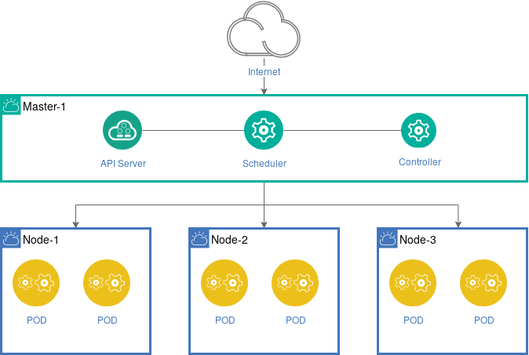
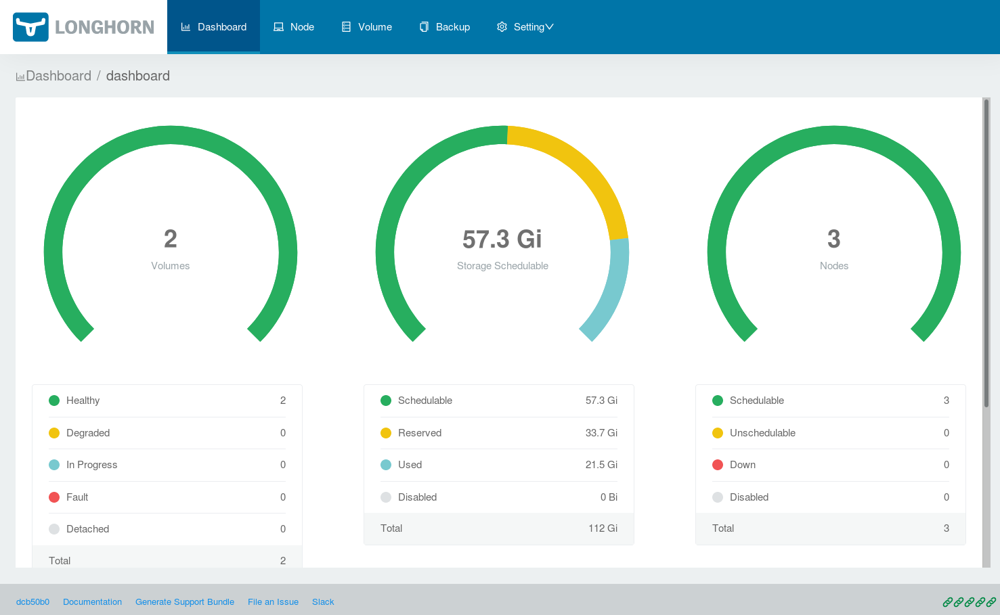
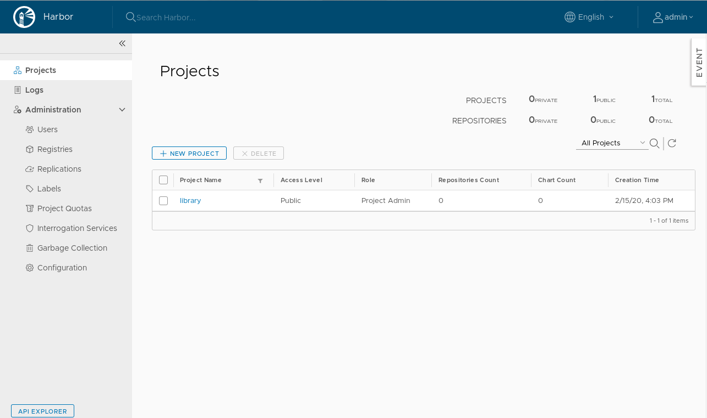

# The Imixs-Cloud

### Build Your Self Managed Kubernetes Cluster!

_Imixs-Cloud_ is an open infrastructure project, providing a lightweight [docker](https://www.docker.com/) based runtime environment for small and medium-sized organizations. 
This projects goal is to **build**, **run** and **maintain** business applications in a production ready and self managed kubernetes cluster.
The main objectives of _Imixs-Cloud_ are **simplicity**, **transparency** and **operational readiness**. 

The runtime environment is based on [Kubernetes](https://kubernetes.io/). Kubernetes is a powerful platform with no limits in scaling and flexibility. _Imixs-Cloud_ provides an easy way to setup and maintain a medium-sized kubernetes cluster environment hosted on virtual servers or bare metal. The project is open source and constantly under development. We sincerely invite you to participate in it!

If you have any questions just open a new [Issue on Github](https://github.com/imixs/imixs-cloud/issues) and start a Discussion. 

#### Topics

 - [Setup, Upgrade & Maintenance Guide](./doc/SETUP.md)
 - [Terminal Tool K9S](tools/k9s/README.md)
 - [Ingress Integration with Traefik](./doc/INGRESS.md)
 - [Distributed Storage solution](./doc/STORAGE.md)
 - [Docker Registry Habor](./doc/REGISTRY.md)
 - [Security Configuration](./doc/SECURITY.md) 
 - [Monitoring](./doc/MONITORING.md)
 - [Continuous Integration CI/CD](./doc/CICD.md)
 - [Kustomize Deployments & Applications](doc/KUSTOMIZE.md)

## Quick Start

The architecture of a *Imixs-Cloud* consists of one Kubernetes master node and one or many Kubernetes worker nodes. This basic architecture can be extended in any dimension. 

For a quick setup you need at least a Debian 10 (Buster) server with a public Internet address and a user with sudo privileges.
All configuration files and scripts are provided in this git repository. You can clone the repository or just copy what you need. You fill find a detailed installation guide in the [setup section](doc/SETUP.md).

### 1. Install Kubernetes

First clone this git repository on your master node. Therefore, you may need to install git:

	$ sudo apt install -y git 
	   
If you are running Fedora or CentOS than use the yum installer
	   
	$ sudo yum install -y git 

next you can clone the imixs-cloud repo from github....

	$ cd && git clone https://github.com/imixs/imixs-cloud.git
	$ cd imixs-cloud/

now you can run the setup script on your master node to install Docker and Kubernetes:
 
	$ sudo ./scripts/setup_debian.sh

If you are running Fedora or CentOS than run:

	$ sudo ./scripts/setup_centos.sh

You can find details about how to create a cluster on the [official kubernets documentation](https://kubernetes.io/docs/setup/production-environment/tools/kubeadm/create-cluster-kubeadm/). 
 
### 2. Initialize Your Kubernetes Master Node

After the basic setup, run the  _kubeadm_  tool to setup your kubernetes master node:

	$ sudo kubeadm init --pod-network-cidr=10.244.0.0/16 --apiserver-advertise-address=[NODE_IP_ADDRESS]

Replace [NODE\_IP\_ADDRESS] with your servers public IP address. At the end the init command will give a install guide how to install the commandline tool 'kubectl' on your host. 

Now deploy a cluster network, this is needed for the internal communication between your cluster nodes. 

	$ kubectl apply -f https://raw.githubusercontent.com/coreos/flannel/master/Documentation/kube-flannel.yml

### 3. Setup Your Kubernetes Worker Nodes

To build your cluster you can join any worker node into your new kubernetes cluster. Just repeat the step 1 on each of your worker nodes. 
After the basic setup on a new worker node is completed, you can join your worker node into your new cluster using the join command from your master node:

	$ sudo kubeadm join xxx.xxx.xxx.xxx:6443 --token xxx.xxxxxxxxx  --discovery-token-ca-cert-hash xxxxxxxxxxxxxxxxxxxxxxxxxxxxxx 

If you do not know the join command run the following command on your master node. This command will just print out the command you need to join the cluster from your worker node:

	$ kubeadm token create --print-join-command
 
After a new worker has joined the cluster you can check the status of your master and worker nodes:

	$ kubectl get nodes

	 
**That's it! Your kubernetes cluster is ready**

You will find a more detailed description about how to setup your Kubernetes cluster in the [setup section](doc/SETUP.md). If you have any probelm or questions just open a new [Issue](https://github.com/imixs/imixs-cloud/issues) on Github. 
In the following sections you will find more information about the concepts of Imixs-Cloud.

 
# The Basic Architecture

The basic architecture of the _Imixs-Cloud_ consists of the following components:

 * A Kubernetes Cluster running on virtual or hardware nodes. 
 * One master node, providing the central services.
 * One or many worker nodes to run your services and applications. 
 * A central Reverse-Proxy service to dispatch requests from the Internet (listening on port 80).
 * A management UI and CLI running on the management node.
 * A private registry to store custom docker images.
 * A distributed storage solution for stateful services. 
 

 
## The Configuration Directory 
 
The complete infrastructure of a _Imixs-Cloud_ environment is described in one central configuration directory. The _Configuration Directory_ can be synchronized with a code repository like Git. This makes it easy to role back changes if something went wrong. You can always start with a new environment by just [forking this Github repository](./doc/GIT.md). 

	$ git clone https://github.com/imixs/imixs-cloud.git && rm -rf imixs-cloud/.git/

The imixs-cloud directory structure contains different sub-directories holding your applications, scripts and tools:

	/-
	 |+ management/
	    |- monitoring/
	    |- registry/
	    |- traefik/
	 |+ apps/
	    |+ MY-APP/
	       |  001-deployment.yaml
	    .....
	 |+ scripts/
	    |  apply.sh
	    |  setup.sh
	    |  delete.sh
	 |+ tools/

 - **apps/** is the place where where your custom business services are configured. Each sub-directory holds at least one kubernetes object description (yaml file). Optional additional configuration files are also located in this directory. 

 - **management/** in this directory you can find all the management services which are part of the _Imixs-Cloud_. This different service are maintained by this project and can be customized for individual needs. 

 - **scripts/**  provides bash scripts to setup a new kubernetes node.

 - **tools/**  provides useful tools

### How to create and delete objects

You can define your own services within the /apps/ directory. Each application has its own sub-folder and consists at least of one configuration yaml file 

	 |+ apps/
	    |+ MY-APP/
	       |  020-deployment.yaml

Using the _kubectl apply_ command you can easily create or delete your services and objects defined within a apps/ or management/ sub-directory:

	$ kubectl apply -f apps/MY-APP/

For example to deploy the traefik configuration you just need to call:

	$ kubectl apply -f management/traefik/
	
In kubernetes all resources and services are typically described in separate files. Use a naming convention to create an implicit order in which your objects should be created.

	 |+ traefik/
	    |- 010.crd-rbac.yaml
	    |- 020.deployment.yaml
	    |- 030.service.yaml

If you want to remove an already deployed service or object just use the delete command:

	$ kubectl delete -f management/traefik/

### Using Kustomize to Manage Custom Configurations

[Kustomize](https://kubernetes.io/docs/tasks/manage-kubernetes-objects/kustomization/) is a tool that allows you to customize Kubernetes resources through a *kustomization.yaml* file and overlay folders. 
*Kustomize* is integrated in the kubectl command-line-tool of Kubernetes and no extra installation is needed to use it. 
For the core service configuration of Imixs-Cloud we do not use *Kustomize* as you should not run the core services in different configurations. For that reason we advice you to directly edit the configuration of the core-services to your individual needs. The documentation explains how to do this for each core service.

However, we recommend to use *Kustomize* for your own applications if you plan to run different versions of a service. For example if you plan to run a production and test version of a service. Read the section [Kustomize Deployments](doc/KUSTOMIZE.md) for more details. 

## Manage your Cluster using K9S

To manage your kubernetes cluster you can use [kubectl](https://kubernetes.io/docs/reference/kubectl/overview/), which is already installed on your master node. There is a huge number of commands to obtain information or change configurations. Take a look into the [kubectl Cheat Sheet](https://kubernetes.io/docs/reference/kubectl/cheatsheet/).

A more convenient way to obtain information about your cluster provides the tool [K9s](https://github.com/derailed/k9s). K9s is a powerful terminal tool to interact with your Kubernetes cluster. 

To install k9s in _Imixs-Cloud_ follow the setup guide [here](tools/k9s/README.md).
After you have install the tool you can start it with:

	$ ~/imixs-cloud/tools/k9s/k9s

## Traefik

To access your applications from outside of your cluster _Imixs-Cloud_ provides the Ingress Router [Traefik.io](https://containo.us/traefik/). This tool allows you to easily expose your services to public Internet addresses.

You can find a detailed description how to install and setup traefik in the [section ingress](./doc/INGRESS.md)

## Storage Volumes

To run stateful docker images (e.g. a Database like PostgreSQL) you need to define a storage volume along with your service. Due to its simplicity and the very good integration in Kubernetes, we use [Longhorn](https://longhorn.io/) as the preferred storage solution within Imixs-Cloud.

You can find a detailed description how to install and setup a Longhorn storage solution in the [section storage](./doc/STORAGE.md)

## Registry

Docker images are available on docker registries. The _Imixs-Cloud_ includes a setup to run the registry [Harbor](https://goharbor.io/).
_Habor_ is a secure, performant, scalable, and available cloud native repository for Kubernetes. 

You can find a detailed description how to install and setup the Harbor registry in the [section registry](./doc/REGISTRY.md)

## Monitoring

_Imixs-Cloud_ also provides also a monitoring feature which allows you to monitor your Kubernetes cluster.

  
  
The monitoring is based on [Prometheus](https://prometheus.io/) which is an open-source systems monitoring and alerting toolkit. You can use this monitoring service not only to montor your kubernetes cluster but also to monitor specific application data. Read more about the monitoring feature [here](doc/MONITORING.md).
  
# Contribute

_Imixs-Cloud_ is open source and your are sincerely invited to participate in it. 
If you want to contribute to this project please [report any issues here](https://github.com/imixs/imixs-cloud/issues). 
All source are available on [Github](https://github.com/imixs/imixs-cloud).

**Note:** My first version was based on [docker-swarm](https://docs.docker.com/engine/swarm/). If you want to run your cluster with docker-swarm switch into the [docker-swarm branch](https://github.com/imixs/imixs-cloud/tree/docker-swarm).
