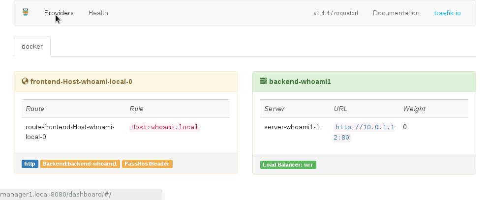

# How to setup the Imixs-Docker-Cloud

The following section describes the setup procedure of Imixs-Docker-Cloud with [Docker-Swarm](https://docs.docker.com/engine/swarm/) into a productive environment. 

Read the following tutorial for general information about how to setup a Docker-Swarm:

* [Docker-Swarm tutorial](https://docs.docker.com/engine/swarm/swarm-tutorial/)
* [Lightweight Docker Swarm Environment by Ralph Soika](http://ralph.soika.com/lightweight-docker-swarm-environment/)

## Hardware Nodes

A Imixs-Docker-Cloud consists of a minimum of two nodes - a management-node and one worker-node. All nodes are defined by unique fixed IP-adresses and DNS names. Only the manager-node need to be accessible through the internet. All nodes in the swarm must be able to access the manager at the IP address.

### Open networks, protocols and ports

The following ports must be available on each node. 

 - TCP port 2377 for cluster management communications
 - TCP and UDP port 7946 for communication among nodes
 - UDP port 4789 for overlay network traffic
 
The nodes communicate via two different overlay networks:

 * imixs-cloud-network - used for the swarm 
 * imixs-proxy-network - used by the reverse proxy
 
To create the overlay networks on the manager-node run:

	$ docker network create --driver=overlay imixs-cloud-net
	$ docker network create --driver=overlay imixs-proxy-net

The following ports are published to be accessable from the internet:

 * 80 - The Reverse proxy endpoint 
 * 8100 - The reverse proxy server UI traefik
 * 8200 - The swarm management UI swarmpit
 * 8300 - The imixs private registry

## Init the swarm manager

To setup docker swarm on the management-node run the following command:

	$ docker swarm init --advertise-addr [manager-ip-address]
	
'manager-ip-address' is the fixed ip address of the manger node to be used by worker nodes. (Typically the main address of the manager-node)

This command init the swarm and returns a pre-configured docker swarm join command for to be executed on any worker-node to joint the swarm. For example: 

	$ docker swarm join --token SWMTKN-1-5acc79cslx83455zcobgkbfxth4t3133ts8s7a1vxap1vwud9-04n5qiicw4qopj3zk32jm5qay 192.168.99.100:2377
	
The IP address given here is the IP from the manager-node.

To verify the nodes in a swarm run:

	$ docker node ls
	ID				HOSTNAME 	STATUS 		AVAILABILITY 	MANAGER STATUS
	niskvdwg4k4k1otrrnpzvgbdn * 	manager1	Ready 		Active 		Leader
	c54zgxn45bvogr78qp5q2vq2c 	worker1		Ready 		Active 

### The Swarm UI – swarmpit.io
Imixs-Docker-Cloud uses [swarmpit.io](http://swarmpit.io) as a lightweight Docker Swarm management UI. 
swarmpit.io is started as a service on the manager node. The configuration is defined by docker-compose.yml located in the folder 'swarmpit/'

To start the service on the manager node:

	$ docker stack deploy -c swarmpit/docker-compose.yml swarmpit

Note: It can take some minutes until swarmpit is started.

After the swarmpit the front-end can be access on port 8200

http://manager-node.com:8200

The default userid is ‘admin’ with the password ‘admin’.

## The Private Docker-Registry

Docker images are available on docker registries. Public docker images are basically available on Docker Hub. Imixs-Docker-Cloud  uses a private docker registry.
The registry is used to push locally build docker images so that the cloud infrastructure can pull and start those services without the need to build the images from a Docker file.

## Create a Self Signed Certificate
The private registry in the Imixs-Docker-Cloud is secured with a TLS (Transport Layer Security). This guaranties that only authorized clients can push or pull an image from the registry.  To secure the registry, a self signed certificate for the manager-node is needed. 

To create the certificate a DNS host name for the manager-node:

	$ mkdir ./registry && cd ./registry
	$ openssl req -newkey rsa:4096 -nodes -sha256 \
	            -keyout domain.key -x509 -days 356 \
	            -out domain.cert
	            Generating a 4096 bit RSA private key
	................................................++
	writing new private key to 'registry_certs/domain.key'
	-----
	You are about to be asked to enter information that will be incorporated
	into your certificate request.
	What you are about to enter is what is called a Distinguished Name or a DN.
	There are quite a few fields but you can leave some blank
	For some fields there will be a default value,
	If you enter '.', the field will be left blank.
	-----
	Country Name (2 letter code) [AU]:DE
	State or Province Name (full name) [Some-State]:
	Locality Name (eg, city) []: 
	Organization Name (eg, company) [Internet Widgits Pty Ltd]: 
	Organizational Unit Name (eg, section) []:
	Common Name (e.g. server FQDN or YOUR name) []:manager-node.com
	Email Address []:

In this examplea x509 certificate and a private RSA key is created with the DNS name (‘Common Name’) _manager-node.com_.
openssl creates two files:

* domain.cert – this file can be handled to the client using the private registry
* domain.key – this is the private key which is necessary to run the private registry with TLS

These files need to be copied into the folder ‘registry/certs/’:

	$ mkdir -p ./registry/certs
	$ cp domain.* ./registry/certs/

The configuration of the registry service is defined by docker-compose.yml located in the folder 'registry/'

To start the service on the manager node:

	$ docker stack deploy -c swarmpit/docker-compose.yml swarmpit
	
	
Create a docker-compose.yml file. See /registry/docker-compose.yml. 

The service can be started with :

	$ docker stack deploy -c registry/docker-compose.yml imixs-registry
	
The registry will be available under port 8300 of the manager-node.

You can check the registry API via the Rest API:

	https://manager-node.com:8300/v2/

### How to grant a Client
To grant your local client to be allowed to push/pull images from the new private docker registry, a copy of the certificate need to be copied into the docker certs.d directory of local client and the docer service must be restart once:

	$ mkdir -p /etc/docker/certs.d/manager-node.como:8300
	$ cp domain.cert /etc/docker/certs.d/manager-node.com:8300/ca.crt
	$ service docker restart

To push a local image from a client into the registry the image must be taged first:

	$ docker tag swarmpit/swarmpit:1.2 manager-node.com:8300/swarmpit/swarmpit:1.2
	$ docker push manager-node.com:8300/swarmpit/swarmpit:1.2
	The push refers to a repository [manager-node.com:8300/swarmpit/swarmpit]
	6afcf119ad8f: Pushed 
	830626953b30: Pushed 
	a1e7033f082e: Pushed 
	78075328e0da: Pushed 
	9f8566ee5135: Pushed 
	1.2: digest: sha256:2ec2c601c936c904aba991a8a2f0961b2382e6c0483fbec1997896e7422030ab size: 1366

The private registry can also be added into swarmpit -  “Registry -> NEW REGISTRY“. Add the URL “https://manager-node-com:8300/”

## The HTTP Reverse Proxy – traefik.io

The HTTP reverse proxy is used to hide services from the internet. In addition the proxy also acts as a load balancer to be used if applications need to be scaled over several nodes.

In Imixs-Docker-Cloud [traefik.io](traefik.io) is used as the service for a reverse proxy. 
The service uses a separate overlay network to scann for services. A service which should be available through the proxy need to be run in the network 'imixs-proxy-net'. 

Traefik is configured by a docker-compose.yml file and a traefik.toml file  located in the folder 'traefik/'

To start the service on the manager node:

	$ docker stack deploy -c traefik/docker-compose.yml imixs-proxy
    
    
After traefik is stared you can access the web UI via port 8100

	http://manager-nodec.om:8100

