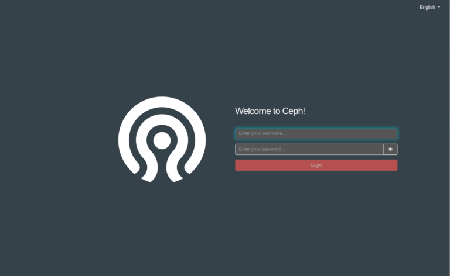
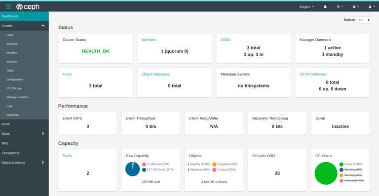
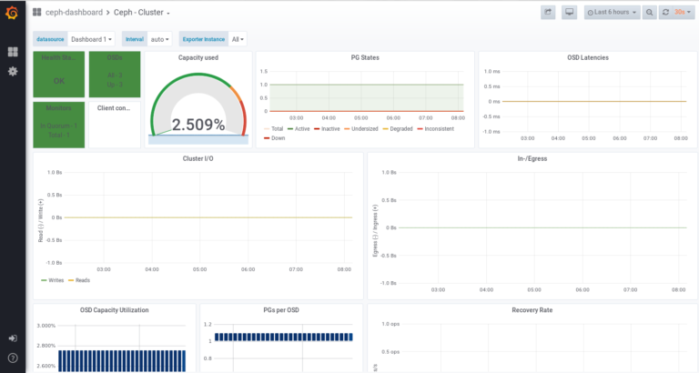
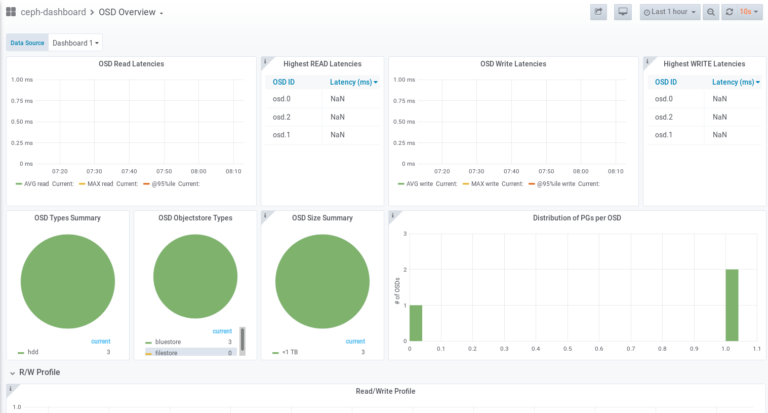

# CEPH

In the following example we assume that your ceph cluster consists of 3 nodes:

    node1 (running manager node)
    node2 (standby manager node and ODS)
    node3 (ODS)

The complete installation is done from your first ceph node (node1). You should create a non-root user to login for the setup process. Do not run the setup as user root.

## Download the Tool ‘cephadm’

First you need to download the cephadm tool which is available on Github.

	$ curl --silent --remote-name --location https://github.com/ceph/ceph/raw/octopus/src/cephadm/cephadm
	$ chmod +x cephadm

In the next step add the ceph debian package sources.

	$ wget -q -O- 'https://download.ceph.com/keys/release.asc' | sudo apt-key add -
	$ echo deb https://download.ceph.com/debian-octopus/ $(lsb_release -sc) main | sudo tee /etc/apt/sources.list.d/ceph.list
	$ sudo apt-get update

Now you should be able to install the ceph-common and the cephadm tools :

	$ sudo ./cephadm install cephadm ceph-common

## Bootstrap your Cluster

In the next you can now bootstrap you ceph cluster. Cephadm will install all services as docker containers including the Ceph Dashboard to monitor the status of your cluster.

	$ sudo mkdir -p /etc/ceph
	$ sudo ./cephadm bootstrap --mon-ip <ip>

Replace <ip> with the IP address of your first manager node within your cluster (node1)

This command may fail with a network error:

	ERROR: Failed to infer CIDR network for mon ip 10.0.0.5; pass --skip-mon-network to configure it later

This seems to be a know issue. You can force the installation by using the –skip-mon-network param:

	$ sudo ./cephadm bootstrap --mon-ip <ip> --skip-mon-network

The cephadmin tool now downloads the docker images to startup a minimal Ceph cluster in docker. The command will print out the access URL for the dashboard::

	INFO:cephadm:Ceph Dashboard is now available at:
	
	             URL: https://node1:8443/
	            User: admin
	        Password: 07jab2z550
	
	INFO:cephadm:You can access the Ceph CLI with:
	
	        sudo ./cephadm shell --fsid 2d2fd136-6df1-11ea-ae74-002590e526e8 -c /etc/ceph/ceph.conf -k /etc/ceph/ceph.client.admin.keyring
	
	INFO:cephadm:Bootstrap complete.

## The CLI

As you have installed the ceph-common package in the step before , you can now use the *ceph* command directly from the first host. For example you may check the current status of your cluster:

	$ ceph status

## CIDR Network

Now you need to fix the missing CIDR Network by running the following ceph command:

	$ sudo ceph config set mon public_network 10.0.0.0/16

## The Dashboard

You can do now a first check of your setup via web browser:

	https://node1:8443/
	
	

Use the admin password shown as the result of your bootstrap command.

But your cluster is still not ready as it only consists of one node. So the next step is to expand your cluster.

## Expending the Cluster

You can expand your cluster by adding additional nodes. At least your ceph cluster should have 3 nodes. In this example:

    node1 (the already running manager node)
    node2 (standby manager node and ODS)
    node3 (ODS)

Make sure your nodes are reachable by name from your manager node.

Before you can add a new node to your cluster, you need to copy the ceph ssh key from your manager node into your new server. This key is needed so that cephadm can proceed the setup on the new host. From the root termnal of your node1 run:

	$ ssh-copy-id -f -i /etc/ceph/ceph.pub root@node2

This will copy the public ceph key to the new server node. You will be asked for the root password on your new host to perform this command. After this you can now install the new host:

	$ sudo ceph orch host add node2

This will add the new host into your cluster. You can repeat the same steps with your third cluster node.

## Add Monitors

It is recommend to deploy monitors on each of your nodes in your cluster. You can set the number of monitors (recommended is 5).

	$ sudo ceph orch apply mon 3
	$ sudo ceph orch apply mon node1,node2,node3

## Adding Storage

Now finally you need to add OSDs to the Ceph cluster. First list the current status run:

	$ sudo ceph orch device ls

To add a device of a cluster node run:

	$ sudo ceph orch daemon add osd node1:/dev/[sdb]

Replace [sdb] with the corresponding device on your cluster node.

If you want to delete the device first (maybe because from a previous try) you can run the following command. NOTE: THIS WILL DELETE YOUR PREVIOUS DATA ON THE DISK!

	$ sudo ceph orch device zap node1 /dev/[sdb] --force

## Verify Cluster Status

Finally you can verify the status of your cluster with the command

	$ sudo ceph status
	  cluster:
	    id:     5ba20356-7e36-11ea-90ca-9644443f30b
	    health: HEALTH_OK
	 
	  services:
	    mon: 1 daemons, quorum node1 (age 2h)
	    mgr: node1.zknaku(active, since 2h), standbys: node2.xbjpdi
	    osd: 3 osds: 3 up (since 100m), 3 in (since 100m)
	 
	  data:
	    pools:   2 pools, 33 pgs
	    objects: 2 objects, 0 B
	    usage:   3.0 GiB used, 117 GiB / 120 GiB avail
	    pgs:     33 active+clean

Or you can check this by the Dashboard in your browser window:

## Advanced Monitoring

As ceph is running on docker there are also additional monitoring services available based on the Prometheus and Grafana projects. The services are automatically started as docker containers by the cephadm tool. Ceph provides several dashboards for visualization of the cluster status, performance data and alerting.

The grafana dashboard can be accessed on port 3000 on your manager node:

https://node1:3000/

Grafana provides various functions to customize dashboards and to configure alerts on your individual needs.

