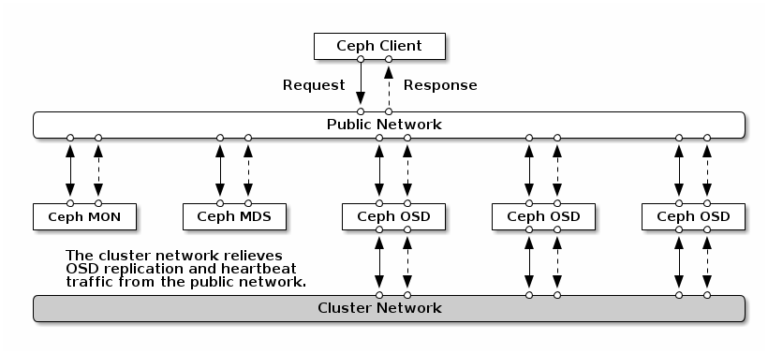
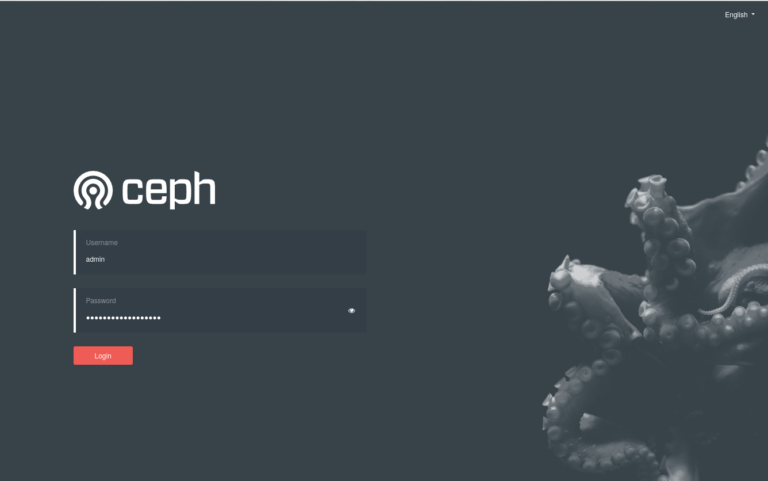
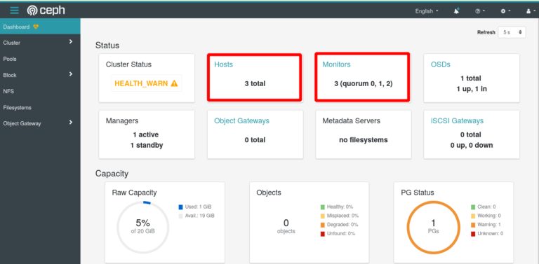
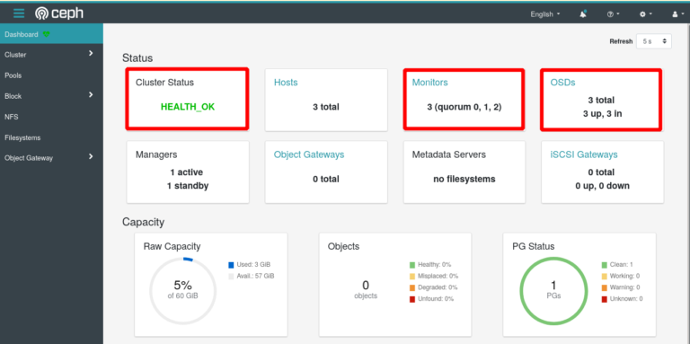
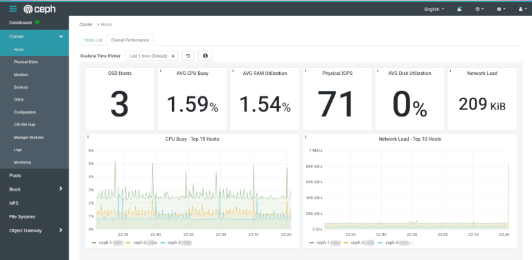

# Ceph - Quick Install Guide

In this section you will find a Quick Install Guide for a Ceph cluster. [Ceph](https://ceph.io/) provides an distributed object storage and block device interface. This makes it a powerful storage solution for Kubernetes. Within *Imixs-Cloud* you can use the [Ceph CSI-Plugin](https://github.com/ceph/ceph-csi) to access a Ceph cluster as a distributed persistence layer. If you already have a Ceph cluster up and running and you just want to connect it to your Kubernetes Cluster, than you may jump directly to the section [ceph-csi plugin](../management/ceph/README.md).

## Architecture

In general the *Imixs-Cloud* project recommends to run a Ceph cluster independent from Kubernetes on separate nodes. In this architecture you run the ceph monitor nodes in a public network to be accessible from a independent Kubernetes cluster. 

In general, the *Imixs Cloud* project recommends running a Ceph cluster independent of Kubernetes on separate nodes. In this architecture, you run the ceph Monitor and OSD nodes on a public network to allow access from an independent Kubernetes cluster. Optional you can add an additional private network for the ceph internal replication, as recommended from the official ceph install guide:

In most cases it is not necessary to run a second private network for Ceph as this may also increase the complexity of a cluster solution.

## Installation

The installation of the latest Ceph release is quite simple using the command line tool [cephadm](https://docs.ceph.com/en/quincy/cephadm/index.html). The official installation guide how to bootstrap a new Ceph cluster can be found [here](https://docs.ceph.com/en/latest/cephadm/install). Also take a look on the installation tutorial for Debian Bullsey [here](https://ralph.blog.imixs.com/2021/10/03/ceph-pacific-running-on-debian-11-bullseye/). 

### Network

In the following setup we assume that your ceph nodes are accessible form the Internet so that ceph can used by an independent Kubernetes Cluster. In most tutorials it is recommended that a Ceph cluster uses at least one private Network for the internal OSD replication. The OSD is the core of a Ceph cluster and responsible to replicate data amongst different nodes. On the other hand a second private network makes only sense if is notedly faster than your public network. If you do not have a separate network adapter in your hardware you can run your cluster also only with a public network. In any case you should protect your ceph cluster with a firewall (find details about a Firewall setup below). 

In the following example we assume that each node has a public IP address for internal communication as also to connect your Kubernetes clients. 

	Hostname   FQDN             Public IP  
	---------+----------------+----------
	ceph-1     ceph-1.foo.com	x.y.z.a	
	ceph-2     ceph-1.foo.com	x.y.z.b	
	ceph-3     ceph-1.foo.com	x.y.z.c	

For a correct setup make sure that you can ping each of your cluster nodes by the hostname and the FQDN (fully qualified domain name) from each node in your ceph cluster. The hostname and FQDN resolve the same public address. You may need to update your /etc/hosts to avoid failures form unreachable DNS services:

	127.0.0.1 localhost
	x.y.z.a   ceph-1.foo.com ceph-1
	x.y.z.b   ceph-2.foo.com ceph-2
	x.y.z.c   ceph-3.foo.com ceph-3	

Find also details [here](https://docs.ceph.com/en/latest/cephadm/host-management/#fully-qualified-domain-names-vs-bare-host-names)

### Installing Ceph

When your Network is ready make sure your have an unprivileged user as you should not run the install script as root. 
*Imixs Cloud* provides a setup Script for Ceph running in Debian 11 (Bullseye) located under `/management/ceph/scripts/ceph_setup.sh`.

Run the Script on each node with sudo rights:

	$ sudo ./ceph_setup.sh

The script will install ceph, the cephadm tool and a Docker runtime. 	

After the installation you should verify first the availability of disks on each node to see if they are accepted by Ceph. 

	$ sudo cephadm ceph-volume inventory
	Device Path               Size         Device nodes    rotates available Model name
	/dev/nvme1n1              476.94 GB    nvme1n1         False   True      SAMSUNG MZVLB512HAJQ-00000
	/dev/nvme0n1              476.94 GB    nvme0n1         False   False     SAMSUNG MZVLB512HAJQ-00000

The disks that you want to use later as OSDs should be marked as `available=true`. Find more details [here](https://docs.ceph.com/en/latest/cephadm/services/osd/#cephadm-deploy-osds).

### Bootstrap Your Cluster

Now as you have prepared your nodes, you can bootstrap your cluster by starting on the first node (in this example this is the node 'ceph-1').

	$ sudo cephadm bootstrap --mon-ip <PUBLIC-IP> --initial-dashboard-user admin --initial-dashboard-password YOURPASSWORD --dashboard-password-noupdate --skip-mon-network

Replace `<PUBLIC-IP>` with the public IP address of your first cluster node 'ceph-1'. The password you give here is used for the Web Admin Dashboard.

The cephadmin tool starts now downloading the docker images to startup a minimal Ceph cluster in docker. The command may take some minutes. When it finished, it will print out the access URL for the dashboard::

	INFO:cephadm:Ceph Dashboard is now available at:

             URL: https://node1:8443/
            User: admin
        Password: 07jab2z550

	INFO:cephadm:You can access the Ceph CLI with:

        sudo ./cephadm shell --fsid 2d2fd136-6df1-11ea-ae74-002590e526e8 -c /etc/ceph/ceph.conf -k /etc/ceph/ceph.client.admin.keyring

	INFO:cephadm:Bootstrap complete.

Only in case you are using a private network, you need to setup now the internal cluster network for your new ceph cluster from the cephadm shell. For example:

	# sudo ceph config set mon cluster_network 10.0.0.0/16

### The Dashboard

You can do a first check of your setup via web browser by opening the Ceph Dashboard:

	https://<your-pulic-ip>:8443/
	
	

Use the user 'admin' and the  password you have passed before in your bootstrap command.

## Expending the Cluster

At this moment your cluster is still not ready as it only consists of one node without any data volumes. So the next step is to expand your cluster by joining additional nodes and storage.

### Join additional Nodes

You can expand your cluster at any time by adding additional nodes and providing object storage devices (OSD). At least your ceph cluster should have 3 nodes.

Before you can add a new node to your cluster, you need to copy the internal ceph ssh key from your boostrap cluster node to each new node. This key is needed by cephadm can proceed the setup on the new nodes. From the root of your first node (ceph-1) run:

	$ ssh-copy-id -f -i /etc/ceph/ceph.pub root@ceph-2

This will copy the public ceph key from your manager node (ceph-1) into the second cluster node (ceph-2). You will be asked for the root password on your new host. After this you can now add the new node to your cluster:

	$ sudo ceph orch host add node2

You can control the cluster status form the web dashboar. 

**Note:** It takes some time until the new node is visible from your manager node. So don’t be to impatient. Wait 1-5 minutes.

Repeat the same steps for each new node.

### Add Monitors

Ceph monitors (mon) are connected from your clients to access the ceph data. It is recommend to deploy monitors on each of your nodes in your cluster. As we want to access the monitors via the public network we disable the automated monitor deployment and label all nodes with the lable ‘mon’ to indicate them as monitor nodes:

	$ sudo ceph orch apply mon --unmanaged
	$ sudo ceph orch host label add ceph-1 mon 
	$ sudo ceph orch host label add ceph-2 mon 
	$ sudo ceph orch host label add ceph-3 mon 

Next add teh new nodes as additional monitors with its public IP to the ceph cluster:

	$ sudo ceph orch daemon add mon ceph-2:<PUBLIC-IP>
	$ sudo ceph orch daemon add mon ceph-3:<PUBLIC-IP>

Replace <PUBLIC-IP> with the public IP address of your node. Repeat this setup for each node. You should have now at least 3 monitors.

**Note:** In this setup, using public Internet IPs, you must **not** set the ceph into the 'managed' mode with `ceph orch apply mon 3`, because in this mode, ceph tries to place the monitors automatically into the private network which will not work in a public network.

You can verify the status of your cluster in parallel from the Ceph Web UI

	

### Adding Storage

Finally you need to add the Object Store Devices (OSDs) to the Ceph cluster. **Note:** Each OSD on a node is a separate hard disc which is NOT mounted!

You can check the status of available hard discs via the Web dashboard or you can list the current status of available devices with the following ceph command:

	$ sudo ceph orch device ls
	Hostname      Path      Type  Serial    Size   Health   Ident  Fault  Available  
	node-1  /dev/sdb  hdd   11680847  21.4G  Unknown  N/A    N/A    No         
	node-2  /dev/sdb  hdd   11680881  21.4G  Unknown  N/A    N/A    Yes        
	node-3  /dev/sdb  hdd   11680893  21.4G  Unknown  N/A    N/A    Yes

To add a device into the cluster run:

	$ sudo ceph orch daemon add osd [node1]:/dev/[sdb]

Replace [node1] with the name of you node and [sdb] with the corresponding device on your cluster node. In the following example we add the disk sdb of node ceph-2 :

	$ sudo ceph orch daemon add osd ceph-2:/dev/sdb
	Created osd(s) 0 on host 'ceph-2'

### Verify Cluster Status

Adding new disks may take also some while. You can verify the status of your cluster via the web dashboard or with the ceph command:

	$ sudo ceph status
	  cluster:
	    id:     5ba20356-7e36-11ea-90ca-9644443f30b
	    health: HEALTH_OK
	 
	  services:
	    mon: 1 daemons, quorum node1 (age 2h)
	    mgr: node1.zknaku(active, since 2h), standbys: node2.xbjpdi
	    osd: 3 osds: 3 up (since 100m), 3 in (since 100m)
	 
	  data:
	    pools:   2 pools, 33 pgs
	    objects: 2 objects, 0 B
	    usage:   3.0 GiB used, 117 GiB / 120 GiB avail
	    pgs:     33 active+clean

Finally the web dashboard of the cluster status should now indicate the status `HEALTH_OK`:

### Using cephadmin on Additional Nodes

After bootstrapping the ceph cluster the ceph command line tool can only be used from the first node. If something went wrong with this node it may be necessary to use the cephadm tool also from the other nodes.

To install the cephadm tool an a second ceph node you need to share the ceph ssh keys. First create the /ect/ceph directory on each additional node

	$ sudo mkdir /etc/ceph

Next copy the ceph.* files from your bootstrap node to each node:

	$ sudo scp /etc/ceph/ceph.* root@ceph-2:/etc/ceph

Now you can run the ceph commands on each node. 

## Firewall Setup

As explained in the beginning this ceph cluster is available on public internet addresses. This requires some security considerations. We want to avoid that unauthorized users can access our cluster. The only necessary ports to be opened are:

    22 – SSH
    6789 – Ceph Monitor Daemon
    
In addition the cluster members as also all client nodes (e.g. your Kubernetes Worker Nodes) should be allowed:
    
    x.y.z.a allow all cluster member via public IP
    .... 
    x.y.z.1 allow all client nodes via public IP

To protect the ceph cluster nodes *Imixs-Cloud* uses the firewall tool *ufw*. You should familiarize yourself with the ufw tool to prevent you from locking yourself out of your server.

To enable the firewall with *ufw* you can use the script *setup_ufw.sh* also located in the management/ceph/scripts/ directory.

**Note:** Before you run this script you need to edit it frist and add your public IPs from your Ceph Cluster and Kubernetes Nodes. Then your can activate the firewall rules on each node:

	$ sudo ./setup_ufw.sh

To verify the status run:

	$ sudo ufw status

To disable the firewall run:

	$ sudo ufw disable

# The Ceph CSI Plugin

After your Ceph Cluster is up and running you can install the Ceph CSI Plugin to access the cluster from a Kuberentes cluster. Follow the setup guide for the Ceph CSI Plugin [here](../management/ceph/README.md).

# Monitoring

Ceph provides a Web Dashboard to check and manage the status of your cluster. In addition ceph also runs also extended monitoring based on Prometheus and Grafana. This monitoring can be included into the Dashboard:

As the graphana services are not protected from unauthorized access you should secure them with a reverse proxy. You can 

# Maintenance 

The following section includes some help for maintenance and trouble shooting.

## Removing a Disk

To remove a OSD securely from your running cluster you need perform several steps carefully. First check the status of all OSDs. You will see the osd number of each osd in your cluster:

	$ sudo ceph osd tree

In the first step you need to take the OSD out of the cluster so that Ceph can begin rebalancing and copying its data to other OSDs. :

    $ sudo ceph osd out {osd-num}

This may take some while. Next you can stop the osd (will be marked as 'down')

	$ sudo ceph orch daemon stop osd.{osd-num}

You can check the status again with `osd tree`. Your OSD should be now marked as 'down'.

Finally you can now delete the osd:

	$ sudo ceph osd crush remove osd.{osd-num}
	$ sudo ceph osd rm {osd-num}
	$ sudo ceph auth del osd.{osd-num}

To erase the data of the corresponding disk you can use in addition the `zap` tool:

	# connect to the cluster node
	# ssh ceph-n
	$ sudo cephadm ceph-volume lvm zap /dev/<DEVICE> --destroy

**NOTE**: This command will delete all data. This operation can take several minutes until the device is cleaned. 

Next you can check the status: 

	$ sudo cephadm ceph-volume inventory
	Device Path               Size         Device nodes    rotates available Model name
	/dev/sdb                  476.94 GB    sdb             False   True      Micron_1100_MTFD
	/dev/sda                  465.76 GB    sda             False   False     Crucial_CT500MX2

The device should not be marked again with the status 'available=true'*	

## Removing a Host

A host can safely be removed from a the cluster after all daemons are removed from it. To drain all daemons from a host, first run:

	$ sudo ceph mon remove *<host>*
	$ sudo ceph orch host drain *<host>*

All osds on the host will be scheduled to be removed. You can check osd removal progress with the following:

	$ sudo ceph orch osd rm status

You can check if there are no daemons left on the host with the following:

	$ sudo ceph orch ps <host>

Finally once all daemons and OSDs are removed you can remove the host:

	$ sudo ceph orch host rm <host>

## Troubleshooting

### Clean old Host Meta Data

If removing a host failed or you are unable to bring the host back again, you may need to clean the cluster information manually. 

First make sure the host is removed from your cluster using the  `--force` option:

	$ sudo ceph orch host rm <host>  --force

The dashboard should now no longer show this host. Next switch to the host of the old node and remove the content from the directory

	# ssh ceph-n
	/var/lib/ceph/<CLUSTERID>
	
Now you should be able to add this host again into your cluster

### entity osd.n exists but key does not match

If you run into a problem where you can't add a previous removed device into your cluster again, you will see a error message like this:

	stderr: Error EEXIST: entity osd.2 exists but key does not match
	....
	Unable to create a new OSD id

The problem here is that your old OSD auth details are still stored in the cluster. If you remove the OSD entry and its auth keys, you should be able to add old OSDs.

	$ sudo ceph osd rm osd.<YOUR-OSD-ID>
	removed osd.0
	
	$ sudo ceph auth del osd.<YOUR-OSD-ID>
	updated

	

 