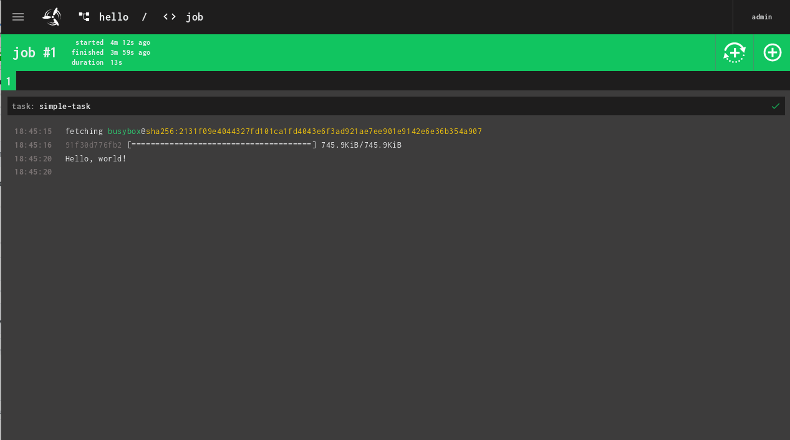

# Imixs-Cloud - CI/CD

Continuous Integration (CI) and Continuous Delivery (CD) are important building blocks for a cloud environment.
The open source project [Concourse](https://concourse-ci.org/) provides a simple mechanic to manage resources, tasks, and jobs and presents a general approach to automation.

## Installation

The installation consists of two parts. 

 - Installation of the concourse server and worker nodes
 - Installation of the command line tool fly
 
Details about the installation can be found in the official [installation guide](https://concourse-ci.org/install.html).

### Generate Keys

Concourse needs a set of key files to securely exchange data between the client and the worker nodes.
You can create the keys using the official concourse Docker containers. 

	
	$ sudo ./management/cicd/generate_keys.sh
	

Use the contents of the keys directory with kubectl to create configmap concourse-config :

	$ kubectl create namespace cicd
	$ kubectl create configmap concourse-config --from-file=./management/cicd/keys -n cicd
	
This config map will be mounted in the concourse.yaml deployment file

## Deployment

Concourse comes with a web interface so you can integrate this interface with traefik. Just replace {YOUR-HOST-NAME} in the 002-deployment.yaml and 002-ingress.yaml file with our domain name.

Next you can start the deployment:

	$ kubectl create -f management/cicd/
	

## Fly

Fly is the command line tool to create and manage pipelines form a client.

### How to Install

Download the fly client from your concourse server:

	$ sudo wget -O /usr/local/bin/fly "https://foo.com/api/v1/cli?arch=amd64&platform=linux"
	$ sudo chmod a+x /usr/local/bin/fly
	
	
### Login

To use fly, you need first to login to your concourse server from your client:

	$ fly --target imixs login -c https://foo.com	
	logging in to team 'main'
	
	navigate to the following URL in your browser:
	
	  https://foo.com/login?fly_port=40287
	
	or enter token manually (input hidden): 
	target saved
	

A URL will be shown which can be opened in a web browser to login. The login token will be valid for 24 hours

You can check the available concourse targets:

	$ fly targets
	name   url                     team  expiry                       
	imixs  https://foo.com  main  Mon, 20 Jul 2020 08:51:53 UTC
	
	
### Pipelines

Based on a yaml file you can now setup a new pipeline. You will find an example pipeline in the /examples/ directory

	$ fly -t imixs set-pipeline \
    --pipeline hello \
    --config hello.yaml
	
You will find further details about concourse on the [official web site](https://concourse-ci.org/docs.html). 	