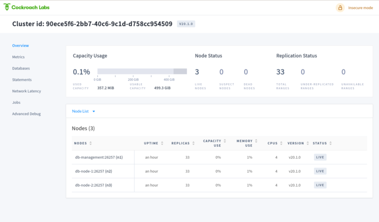

# Cockroach

The [CockroachDB](https://www.cockroachlabs.com/) is a distributed SQL database with a build in replication mechanism. 
The database can be used as a central database cluster running as part of the Imixs-Cloud. 

Cockroach provides  a build in replication mechanism. This means that the data is replicated automatically over several nodes in a database cluster. This increases the scalability and resilience in the case that a single node fails. With its Automated-Repair feature the database also detects data inconsistency and automatically fixes faulty data on disks. The project is Open Source and hosted on [Github](https://github.com/cockroachdb/cockroach).

## Web Frontend

Cockroach provides a Web Frontend with a dashboard to monitor all metrics about the running database cluster. 

## How to Install

To install CockroachDB into your Imixs-Cloud environment follow the [install guide](../management/cockroachdb/README.md).
You can run  CockroachDB on all your cluster nodes or you can define specific selection criterias with the concept of [Node affinities](https://kubernetes.io/docs/concepts/scheduling-eviction/assign-pod-node/#node-affinity) and [Taints and Tolerations](https://kubernetes.io/docs/concepts/scheduling-eviction/taint-and-toleration/).

## The Cockroach Client

The cockroach client provides a command line tool to administrate the cluster and to open a SQL client shell to create and edit databases and table schemas. The client is installed as a separate POD within your Kubernetes Cluster. 

To access the client your need a ssh into the client POD

	$ kubectl exec -it -n cockroach cockroachdb-client-secure -- bash

From there you can enter the SQL client:

	$ cockroach sql --certs-dir=/cockroach-certs --host=cockroachdb-public
	
	# Welcome to the CockroachDB SQL shell.
	# All statements must be terminated by a semicolon.
	# To exit, type: \q.
	#
	# Server version: CockroachDB CCL v20.2.8 (x86_64-unknown-linux-gnu, built 2021/04/23 13:54:57, go1.13.14) (same version as client)
	# Cluster ID: d49fa52b-4fee-4599-9aed-a5798fdf1b35
	#
	# Enter \? for a brief introduction.
	#
	root@cockroachdb-public:26257/defaultdb>
	

## JDBC

Cockroach supports the PostgreSQL wire protocol and can be used out of the box for the Java Enterprise Applications and Microservices using the standard PostgresSQL JDBC driver.

Cockroach runs in the namespace 'cockroach'. To access the database from a java application you can use a JDBC connection like in the following example:

	jdbc:postgresql://cockroachdb-public.cockroach:26257/YOUR-DATABASE

### ACIC Transactions

CockroachDB fully supports distributed ACID transactions. This means guaranteed atomicity, isolation, consistency, and durability of data. This allows CockroachDB to be used in combination with Jakarta EE and JPA. 

	
