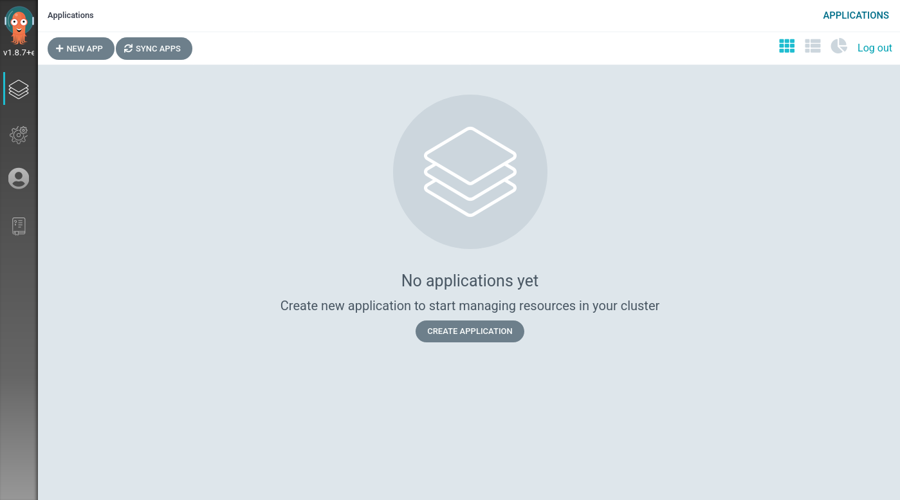

# GitOps with Imixs-Cloud

*Imixs-Cloud* provides with its directory structure of separate sub-directories for each application the core concept of *Infrastructure as Code*. Stored in a Git repository this enables declarative, continuous deliverys - called GitOps. 
All objects are provided in a root git repository:

	/-
	 |+ management/
	    |- monitoring/
	    |- registry/
	    |- nginx/
	 |+ apps/
	    |+ MY-APP/
	       |  001-deployment.yaml
	    .....
	    
## Argo CD

Argo CD is a GitOps continuous delivery tool for Kubernetes. Running Argo CD within the *Imixs-Cloud* provides a convenient way to control application definitions, configurations, and environments in a declarative way. By adding Argo CD you extend the way to control all your applications running with the *Imixs-Cloud*.

### Quick Setup

For a quick setup we use the official install.yaml file form the argo-cd github page.

	$ kubectl create namespace argocd
	$ kubectl apply -n argocd -f https://raw.githubusercontent.com/argoproj/argo-cd/stable/manifests/install.yaml

The startup may take some seconds. 

For the Ingress configuration the directory */management/argo-cd* includes additional resource objects. Edit the file '030-ingress.yaml' and replace '{YOUR-DOMAIN-NAME}' with your Internet domain name.

Next you can apply the Ingress configuration to your running argo-cd instance:

	$ kubectl apply -f management/argo-cd/030-ingress.yaml

In the official [Getting Started Guide](https://argo-cd.readthedocs.io/en/stable/getting_started/) of the Argo CD project you will find additional information.

#### First Login

For the first login argo-cd generates a random password for the user 'admin'. The password can be retrieved with the command:

	$ kubectl -n argocd get secret argocd-initial-admin-secret -o jsonpath="{.data.password}" | base64 -d; echo

Using the username admin and the password from above, you can login to Argo CD's Web UI.

### Configure a Application

Argo CD allows you to configure the deployment for each of your application manually in various ways. After you have added your Git repository you can add a application to be monitored by Argo CD

