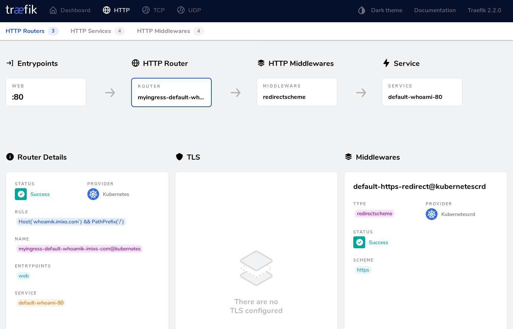
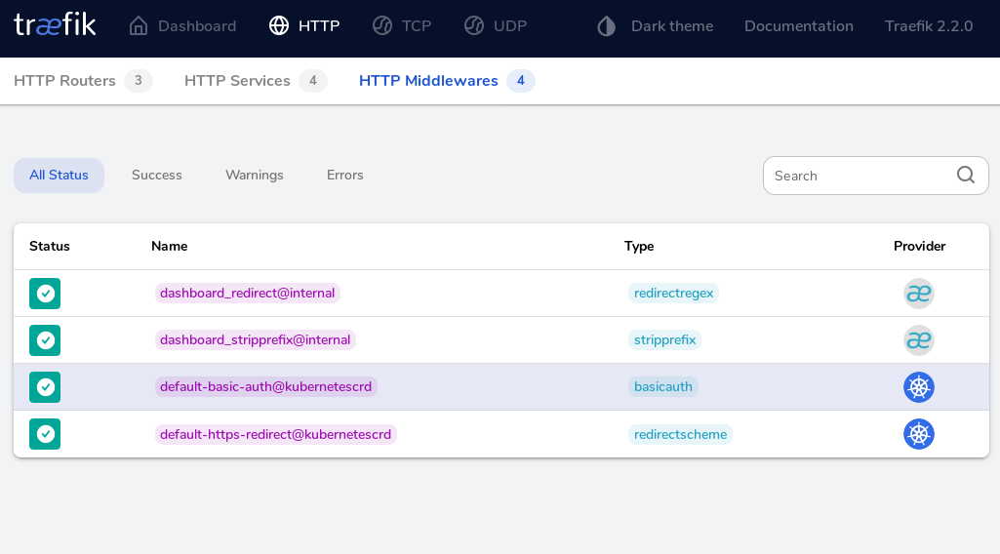

# Ingress Configuration with Traefik.io

In general services running in a kubernetes cluster are not visible from outside or the Internet. To gain access from the Internte to a single service or app running inside your cluster you need a so called _Ingress Network_ .   
_Imixs-Cloud_ provides a Ingress Configuration based on [Traefik.io](http://traefik.io).
Traefik.io is a reverse proxy and load balancer to be used within a kubernetes cluster. Traefik provides Custom Resource Definitions (CRD) for routing HTTP/HTTPS requests from outside of your cluster to particular services. 

To deploy traefik.io within the _Imixs-Cloud_ run:

	$ kubectl apply -f management/traefik/
		

## Configuration

The traefik setup consists of a set of resource yaml files.

 - 001-rbac.yaml - defines the roles needed by traefik
 - 002-deployment.yaml - defines the traefik deployment object including the Let's Encrypt configuration
 - 003-services.yaml - defines the services for http/https and dashboard
 - 004-middleware.yaml - optional definition of middlewares (e.g. HTTPS Redirect)
 - 005-ingress.yml - optional definition for a ingress to the dashboard

### 1. The Deployment Configuration

The file _002-deployment.yaml_ contains the deployment configuration for Traefik.io. This also includes a Let's Encrypt setup to provide SSL certificates. 

Before your apply the traefik configuration please edit the file _002-deployment.yaml_ and replace the place holder _{YOUR-E-MAIL}_ with the e-mail address of your organization.

Also comment the ACM Staging server from the Let's Encrypt setup after you have tested your cluster setup. The stating setup is just simulating certificates but not creating them. 

        # comment staging server for production
        - --certificatesresolvers.default.acme.caserver=https://acme-staging-v02.api.letsencrypt.org/directory
        - --certificatesresolvers.default.acme.email={YOUR-E-MAIL}

### 2. The Ingress Configuration  

The file _003-ingressroute.yaml_ contains the ingress configuration for the Taefik.io service.  
The spec defines a external IP address which is used to route external requests to one cluster node. Traffic that ingresses into the cluster with the external IP (as destination IP), on the Service port, will be routed to one of the Service endpoints. External IPs are not managed by Kubernetes and are the responsibility of the cluster administrator. Find more details [here](https://kubernetes.io/docs/concepts/services-networking/service/#external-ips).

So before you apply the traefik configuration please replace the _{MASTER-NODE-IP}_ with the Node IP address of one of your kubernetes cluster nodes used to ingress external traefik. This should typically be the IP address from your master node.
 
	spec:
	  externalIPs:
	  - {MASTER-NODE-IP} 
	  
	  
### 3. Apply Your Configuration
	  
After you have configured the resource yaml files you can apply your changes to the kubernetes cluster:

	$ kubectl apply -f management/traefik/

## Ingress 

Now you can define your own Ingress within  your POD to gain access from the internet via traefik.
The following example shows a simple Ingress configuraiton 

	kind: Ingress
	apiVersion: networking.k8s.io/v1beta1
	metadata:
	  name: myingress
	  annotations:
	    traefik.ingress.kubernetes.io/router.entrypoints: web
	spec:
	  rules:
	  - host: example.foo.com
	    http:
	      paths:
	      - path: /
	        backend:
	          serviceName: whoami
	          servicePort: 80

With the annotation "traefik.ingress.kubernetes.io/router.entrypoints" you define that your service (whami) should be routed by traefik. 

You can control your ingress configuraiton from the traefik web ui:

### HTTP -> HTTPS redirects

You can also define redirects from HTTP to HTTPS. This makes your service more secure as direct access via HTTP is blocked. The following example defines two ingress - one for http with a redirect and the https ingress: 

	kind: Ingress
	apiVersion: networking.k8s.io/v1beta1
	metadata:
	  name: myingress
	  annotations:
	    traefik.ingress.kubernetes.io/router.entrypoints: web
	    traefik.ingress.kubernetes.io/router.middlewares: default-https-redirect@kubernetescrd
	spec:
	  rules:
	  - host: example.foo.com
	    http:
	      paths:
	      - path: /
	        backend:
	          serviceName: whoami
	          servicePort: 80
	
	---
	
	kind: Ingress
	apiVersion: networking.k8s.io/v1beta1
	metadata:
	  name: myingress-tsl
	  annotations:
	    traefik.ingress.kubernetes.io/router.entrypoints: websecure
	    traefik.ingress.kubernetes.io/router.tls: "true"
	spec:
	  rules:
	  - host: example.foo.com
	    http:
	      paths:
	      - path: /
	        backend:
	          serviceName: whoami
	          servicePort: 80

	

To test your traefik setup you can deploy the 'whoami' service which is part of the _/apps/_ .
Edit the file /apps/whoami/003-ingress.yaml and apply your configuration:

	$ kubectl apply -f whoami/

The next section will explain the middleware components. 

## Middleware

With the concept of [middlewares](https://docs.traefik.io/routing/routers/#middlewares) you can refine the routing of a ingress rule. 
For example you can redirect a HTTP request to HTTPS or your can add a basic authentication to secure your service. 

### HTTP to HTTPS Redirectscheme

The [Middleware RedirectScheme](https://docs.traefik.io/middlewares/redirectscheme/)  is used for a redirection from HTTP to HTTPS:

	# Redirect http -> https
	---
	apiVersion: traefik.containo.us/v1alpha1
	kind: Middleware
	metadata:
	  name: https-redirect
	spec:
	  redirectScheme:
	    scheme: https
	    permanent: true
	    port: 443
	    

To apply the HTTP->HTTPS Redirectscheme you just need to add the annotation in your ingress objects:

	kind: Ingress
	apiVersion: networking.k8s.io/v1beta1
	metadata:
	  name: myingress
	  annotations:
	    traefik.ingress.kubernetes.io/router.entrypoints: web
	    traefik.ingress.kubernetes.io/router.middlewares: default-https-redirect@kubernetescrd
    ....

**Note:** the name of the middelware need to be fraefixed with 'default-' and suffixed with '@kubernetescrd' 

### Adding Basic Authentication

The [Middleware BasicAuth](https://docs.traefik.io/middlewares/basicauth/) is a quick way to restrict access to your services to known users. 
The middleware can be configured with a list of user/password pairs. 

#### 1. Generate a password file

First generate a password file on your master node with your user:password pairs. You can use the commadline tool 'htpasswd' which is part of the apache2-utils.
The following command will add a new user:password pair to a local stored password file named '.kubepasswd'

	$ htpasswd -nb admin adminadmin >> .kubepasswd
	$ htpasswd -nb user password >> .kubepasswd

In kubernetes a user:password string must be base64-encoded. To create an encoded user:password pairs from your password file run the following command:

	$ cat .kubepasswd | openssl base64
	YWRtaW46JGFwcjEkWXdmLkF6Um0kc3owTkpQMi55cy56V2svek43aENtLwoKdXNl
	cjokYXByMSRaU2VKQW1pOSRVV1AvcDdsQy9KSzdrbXBIMXdGL28uCgo=

The output is needed for the traefik middleware configuration.

#### 2. Define a Traefik Middleware

The following middleware definition creates a basic authentication layer in the file admin-auth.yaml:

	apiVersion: traefik.containo.us/v1alpha1
	kind: Middleware
	metadata:
	  name: basic-auth
	spec:
	  basicAuth:
	    secret: authsecret
	
	---
	apiVersion: v1
	kind: Secret
	metadata:
	  name: authsecret
	  namespace: default
	data:
	  users: |2
	    YWRtaW46JGFwcjEkWXdmLkF6Um0kc3owTkpQMi55cy56V2svek43aENtLwoKdXNl
	    cjokYXByMSRaU2VKQW1pOSRVV1AvcDdsQy9KSzdrbXBIMXdGL28uCgo=

Below the section data.users paste your own encoded user password file content.  
  
Apply your new basicAuth middleware with:

	$ kubectl apply -f admin-auth.yaml

#### 3. Secure a Service with Basic Authentication

Now you can use the baicAuth middleware in your own ingress definition. See the following example:

	# IngresRoute http with basicAuth
	---
	kind: IngressRoute
	apiVersion: traefik.containo.us/v1alpha1
	metadata:
	  name: my-service
	  namespace: default
	
	spec:
	  entryPoints: 
	    - web
	  routes:
	  - match: Host(`myservice.foo.com`) 
	    kind: Rule
	    services:
	    - name: my-service
	      port: 80
	    middlewares: 
	    - name: basic-auth

    

### Middleware Chains

The [Middlware Chain](https://docs.traefik.io/middlewares/chain/) enables you to define reusable combinations of middleware.
So for example you can define a Chain Middleware to secure your service and to redirect HTTP->HTTPS. See the following example:

	# Secure and Redirect...
	---
	apiVersion: traefik.containo.us/v1alpha1
	kind: Middleware
	metadata:
	  name: secured
	spec:
	  chain:
	    middlewares:
	    - name: basic-auth
	    - name: https-redirect

If you set this middleware in your ingress definition, your service will be secured and redirected form HTTP to HTTPS.

## IngressRoute

IngresRoute is a specific object defined by traefik. In general you can use kubernetes ingress objects as explained in the section above. But of course you can use also the traefik specific IngressRoute object to define an Ingress if needed. Within the general traefik setup we activated both - the kubernetes-crd provider and the kuberntes-ingress provider.

You can find more about traefik ingressRoute objects [here](https://docs.traefik.io/providers/kubernetes-crd/) 

See the following example defining a traefik Ingres Route for a service:

	# IngresRoute http
	---
	kind: IngressRoute
	apiVersion: traefik.containo.us/v1alpha1
	metadata:
	  name: whoami-notls
	  namespace: default
	
	spec:
	  entryPoints: 
	    - web
	  routes:
	  - match: Host(`example.foo.com`) 
	    kind: Rule
	    services:
	    - name: whoami
	      port: 80
	    # redirect http to https
	    #middlewares: 
	    #- name: https-redirect
    
    
