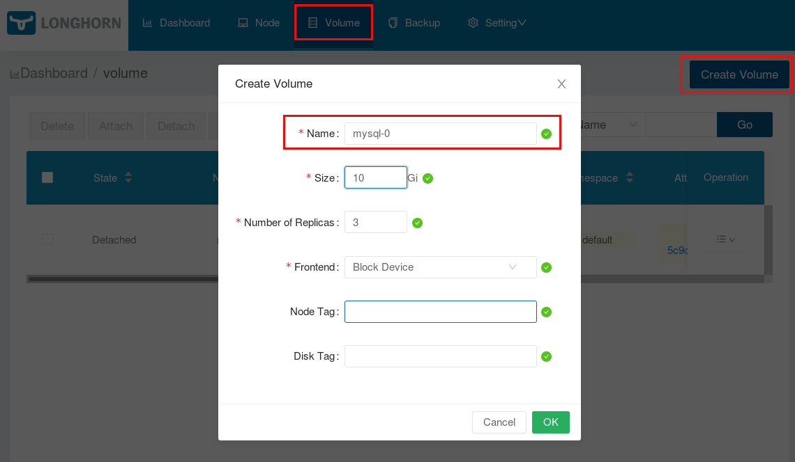

# Longhorn

Longhorn is a cloud native distributed block storage for Kubernetes. Longhorn delivers simplified, easy to deploy and upgrade, 100% open source, cloud-native persistent block storage without the cost overhead of open core or proprietary alternatives. This makes Longhorn very easy to integrate in a Kubernetes cluster.

## Quick Setup

For a quick setup check the file /management/longhorn/002-ingress.yaml. This file will provide a placeholder for the Longhorn Web UI. If you have setup this file to your needs you can start Longhorn within the Imixs-Cloud with:

	$ kubectl apply -f management/longhorn/

The deployment may take some minutes. Corresponding to your ingress configuration you can open the Longhorn Web UI to administrate your cluster.

You will find a detailed documentation [here](https://longhorn.io/docs/). The following section describes the setup process in more detail.

## Setup of Longhorn
 
The longhorn configuration is defined in the service directory /management/longhorn . You can modify the setup and apply your individual settings as described in the following sections.

### open-iscsi
	
Longhorn is based on open-iscsi. So first make sure that 'open-iscsi' has been installed on all the nodes of the Kubernetes cluster, and the _iscsid_ daemon is running on all the nodes.

For Debian/Ubuntu, use the following command to install open-iscsi if it is not already installed: 

	$ sudo apt-get install open-iscsi

### Install Longhorn into your Cluster

For a quick test you can install Longhorn  into your Kubernetes cluster using the command:

	$ kubectl apply -f https://raw.githubusercontent.com/longhorn/longhorn/master/deploy/longhorn.yaml

This will start Longhorn with the latest release. If you want to have more control you can customize the longhorn configuration provided by _Imixs-Cloud_ in the directory  management/longhorn/

To start longhorn from you custom setup run:

	$ kubectl apply -f management/longhorn/

The startup can take a while. You can monitor the startup with the [K9s tool](../tools/k9s/README.md).

### The Longhorn-UI

Longhorn comes with a UI web interface to monitor and administrate the cluster. To access the UI from you _Imixs-Cloud_ setup you have to create a ingress for the Longhorn UI with a traefik ingress route. Just edit the file management/longhorn/002-ingress.yml and replace {YOUR-DNS} with a DNS name pointing to your cluster and apply the ingress route:

	kind: IngressRoute
	apiVersion: traefik.containo.us/v1alpha1
	metadata:
	  name: longhorn-frontend
	  namespace: longhorn-system
	
	spec:
	  entryPoints: 
	    - web
	  routes:
	  - match: Host(`{YOUR-DNS}`) 
	    kind: Rule
	    services:
	    - name: longhorn-frontend
	      port: 8000
	    

## Create Longhorn Volumes

Before you can create Kubernetes volumes within Longhorn, you must first provide a storage class. _Imixs-Cloud_ is already providing a default StorageClass for longhorn in the file /longhonr/003-storageclass.yaml

	kind: StorageClass
	apiVersion: storage.k8s.io/v1
	metadata:
	  name: longhorn
	  annotations:
	    # make this class the default storage class
	    storageclass.kubernetes.io/is-default-class: "true"
	    
	provisioner: driver.longhorn.io
	allowVolumeExpansion: true
	parameters:
	  numberOfReplicas: "3"
	  staleReplicaTimeout: "2880" # 48 hours in minutes
	  fromBackup: ""

This storage class definition will automatically create 3 replicas of a persistence volume. You can change the storageClass to your individual needs. To apply the new storage class run:

	$ kubectl apply -f management/longhorn/003-storageclass.yaml

**Note:** The storage class 'longhorn' is marked as the 'default' storage class within the cluster. This allows you to create a PersistentVolumeClaim with an unspecified storageClassName. Find details [here](https://kubernetes.io/docs/concepts/storage/dynamic-provisioning/#defaulting-behavior).

### Create a Volume Claim

Now you can easily create a Persistence Volume Claim (PVC) within your pod using the _longhorn_ StorageClass. You do not need to create a PersistenceVolume manually because the storageClass will create a PV dynamically. 

	apiVersion: v1
	kind: PersistentVolumeClaim
	metadata:
	  name: dbdata
	spec:
	  accessModes:
	    - ReadWriteOnce
	  storageClassName: longhorn
	  resources:
	    requests:
	      storage: 2Gi

You can read more about the topic in the kubernetes documentation - [Dynamic Volume Provisioning](https://kubernetes.io/docs/concepts/storage/dynamic-provisioning/)

### The Reclaim Policy of a PersistentVolume

PersistentVolumes can have various reclaim policies, including “Retain”, “Recycle”, and “Delete”. For dynamically provisioned PersistentVolumes, the default reclaim policy is “Delete”. This means that a dynamically provisioned volume is automatically deleted when the PVC or service was deleted.  This automatic behavior might be inappropriate because previous data will be lost. In that case, it is more appropriate to use the “Retain” policy. With the “Retain” policy, if a service and its PersistentVolumeClaim was deleted, the corresponding PersistentVolume will not be deleted. Instead, it is moved to the Released phase, where all of its data can be manually recovered.

For this you can change the reclaimPolicy in your custom StorageClass.

	  reclaimPolicy: Retain

The _Imixs-Cloud_ project is already providing such a StorageClass called 'longhorn-durable'. You can check the status of your storageClass with:

	$ kubectl get StorageClass

### Durable Persistence Volumes

As mentioned above when you delete a PVC, the corresponding PV will be deleted too, or released in case of the reclaimPolice 'Retain'.
But even if the PV is not being deleted, this PV can not automatically be bound again to a POD. The reason for this is that a PV usually contains sensitive data and that is why kubernetes provides no possibility to bind to it, even if it is a PVC with the same name and in the same namespace as the previous one - who knows who's trying to steal the data!

To use a PV also in this scenario you need to define a durable persistence volume manually. You make the PV available to a specific PVC by setting the PV.Spec.ClaimRef with a pointer to a PVC. See the following example:  

	---
	kind: PersistentVolume
	apiVersion: v1
	metadata:
	  name: mysql-pv
	spec:
	  capacity:
	    storage: 2Gi
	  volumeMode: Filesystem
	  accessModes:
	    - ReadWriteOnce
	  claimRef:
	    namespace: default
	    name: mysql-pvc
	  csi:
	    driver: driver.longhorn.io
	    fsType: ext4
	    volumeHandle: mysql-0
	  storageClassName: longhorn-durable
	---
	apiVersion: v1
	kind: PersistentVolumeClaim
	metadata:
	  name: mysql-pvc
	spec:
	  accessModes:
	    - ReadWriteOnce
	  storageClassName: longhorn-durable
	  resources:
	    requests:
	      storage: 2Gi
	  volumeName: "mysql-pv"

The PV definition _spec.csi.volumeHandle_ points to a pre-created volume. This is an administrative job to done by the Cluster-Administrator. In Longhorn you can easily create the Persistence Volume form the UI:

After you have created the volume in Longhorn you can deploy your POD with the PV/PVC definition. 

**Note:** the acccessMOdes and the storage capacity in the PV must match the PVC definition

## Known Problems

There is also a [forum](https://forums.rancher.com/c/longhorn) to discuss questions with the longhorn community. Some known problems and how you can handle them is listed below: 

### Data Directory exists but is not empty

It may happen that after you try to run your service you see an error message like in the following postgresql example: 

	initdb: directory "/var/lib/postgresql/data" exists but is not empty It contains a lost+found directory, 
	perhaps due to it being a mount point. Using a mount point directly as the data directory is not recommended. 
	Create a subdirectory under the mount point.

In such a case you just need to add a subPath

	...
	volumeMounts:
	- mountPath: /var/lib/postgresql/data
	  name: test-db-volume
	  subPath: postgres
	...

See more details [here](https://stackoverflow.com/questions/51168558/how-to-mount-a-postgresql-volume-using-aws-ebs-in-kubernete/51174380).

### AttachVolume.Attach failed

In some cases it may happen that you can not deploy because of a error message like this:

	AttachVolume.Attach failed for volume "xxxx" : rpc error: code = FailedPrecondition desc = The volume xxx cannot be attached to the node node-x since it is already attached to the node node-y   
  
In this case you can solve the problem as followed:

  
1.) Deelte your deployment as usual

	$ kubectl delete -f apps/my-app....

2.) Verify if the volume in question was deleted

	$ kubectl get pv

If not, you may see that the persistence volume is in status 'terminating'. To get rid of this situation run:

	$ kubectl patch pv [PV-NAME] -p '{"metadata":{"finalizers":null}}'
	
	# replace [PV-NAME] with the name of your persistence volume
	

3.) Detach the volume manually via the Longohorn UI 
  
  Within the Longhorn UI you can verify if the volume is now in status 'detached'. If not, you can detach is via the volume options.
  
  
4.) Re-Apply your Deployment

Finally you can re-deploy your application:

	$ kubectl apply -f apps/my-app....

## How to Uninstall Longhorn

To prevent damaging the Kubernetes cluster, it is recommended deleting all Kubernetes workloads using Longhorn volumes (PersistentVolume, PersistentVolumeClaim, StorageClass, Deployment, StatefulSet, DaemonSet, etc) first.

You can create the uninstallation job to clean up CRDs from the system and wait for success:

	$ kubectl create -f https://raw.githubusercontent.com/longhorn/longhorn/master/uninstall/uninstall.yaml
	
The uninstall process can take a while.

Example output:

	$ kubectl create -f https://raw.githubusercontent.com/longhorn/longhorn/master/uninstall/uninstall.yaml
	serviceaccount/longhorn-uninstall-service-account created
	clusterrole.rbac.authorization.k8s.io/longhorn-uninstall-role created
	clusterrolebinding.rbac.authorization.k8s.io/longhorn-uninstall-bind created
	job.batch/longhorn-uninstall created
	
	$ kubectl get job/longhorn-uninstall -w
	NAME                 COMPLETIONS   DURATION   AGE
	longhorn-uninstall   0/1           3s         3s
	longhorn-uninstall   1/1           20s        20s
	^C

Remove remaining components:

	$ kubectl delete -f management/longhorn/
	$ kubectl delete -f https://raw.githubusercontent.com/longhorn/longhorn/master/uninstall/uninstall.yaml

Find details about the uninstall process also [here](https://github.com/longhorn/longhorn#uninstall-longhorn).
	

### Delete namespace 'longhorn-system'

To remove the longhorn-system namespace you can run the following command:

	$ kubectl get namespace "longhorn-system" -o json \
	  | tr -d "\n" | sed "s/\"finalizers\": \[[^]]\+\]/\"finalizers\": []/" \
	  | kubectl replace --raw /api/v1/namespaces/longhorn-system/finalize -f -
  