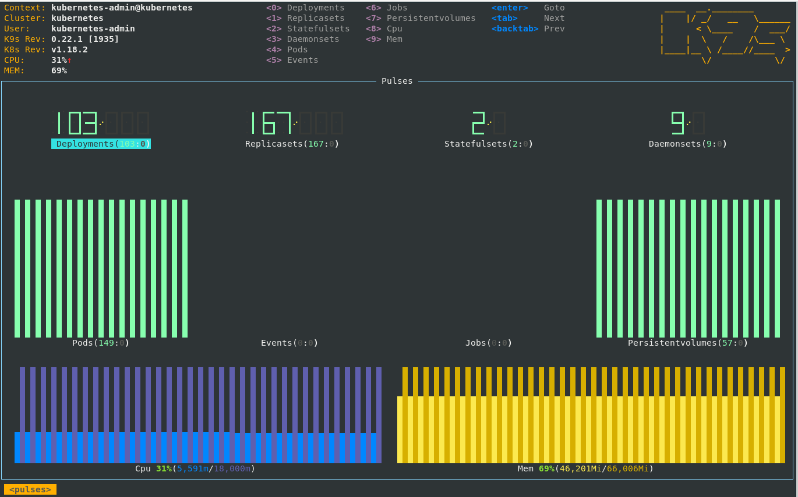

# How to Monitor Imixs-Cloud

To get better insights of your Imixs-Cloud* project you can install a monitoring service. Kubernetes provides several ways to collect and monitor cluster metrics like the memory or CPU usage of cluster nodes or pods. Kubernetes makes these data available through the Metrics API. These metrics can be accessed either directly by the user with the kubectl top command, or by a controller in the cluster, for example Horizontal Pod Autoscaler, to make decisions.

The *Imixs-Cloud* monitoring provides different setups to install a monitoring solution. 

 * [metrics-server](METRICS_SERVER.md) is a scalable, efficient source of container resource metrics for Kubernetes built-in autoscaling pipelines.
 * [kube-prometheus](KUBE_PROMETHEUS.md) provides a configuration setup for a complete cluster monitoring stack. 

After a metric server was installed you can monitor your Kubernetes cluster from the commandline tool **kubectl top**:

	$ kubectl top nodes
	NAME       CPU(cores)   CPU%   MEMORY(bytes)   MEMORY%   
	master-1   297m         14%    1358Mi          36%       
	worker-1   1424m        35%    13913Mi         89%       
	worker-2   1258m        31%    11278Mi         72%       
	worker-3   1133m        28%    9956Mi          63%       

	
You can also get the data of a singel POD:

	$ kubectl top pod traefik-797d34bc7d-l7k8j -n kube-system
	NAME                       CPU(cores)   MEMORY(bytes)   
	traefik-797d34bc7d-l7k8j   22m          50Mi      

The [k9s tool](../tools/k9s/README.md) provides the core functionallity to display metrics of the cluster and for each namespace. With the :pulse view you can see node dashboard.

## Prometheus

[Prometheus](https://prometheus.io/) is an open-source systems monitoring and alerting toolkit. 
The Prometheus service is the database used for collecting the metric data. The Prometheus server is typically only used internal to grab data from the metric api and not accessible from outside of your cluster. The internal address for data access is:

	http://prometheus:9090

## Grafana

The [Grafana](https://grafana.com/) service is the front-end application used to visualize the data collected by Prometheus. 
The grafana service provides a web interface with rich functionality for monitoring and alerting. 

To access grafana you need ot setup a Ingress route. See the [Deployment Guide](../management/monitoring/README.md) for details.
 

See the install guides for [metrics-server](METRICS_SERVER.md) and [kube-prometheus](KUBE_PROMETHEUS.md) for further details.

