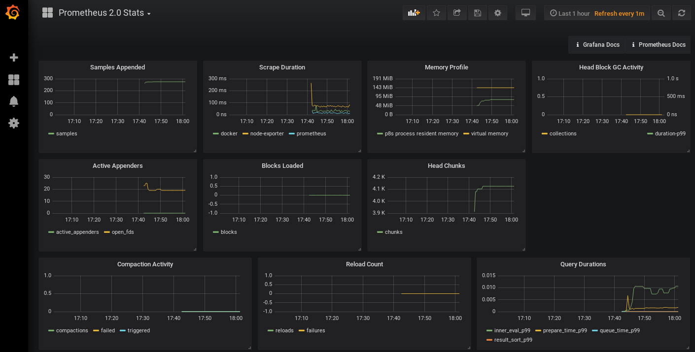

# How to Montior Imixs-Cloud

_Imixs-Cloud_ also provides a monitoring feature which allows you to monitor your docker-swarm.

The following section describes how you can monitor Imixs-Cloud. The monitoring stack in Imixs-Cloud provides the following services:

 * Prometheus - the prometheus main service configured for docker-swarm.
 * Node-Exporter - a prometheus service which provides the machine data from every node in your docker-swarm.
 * Grafana - the monitoring dashboard connected to prometheus.

## Prometheus

[Prometheus](https://prometheus.io/) is an open-source systems monitoring and alerting toolkit. 
The Prometheus service can be integrated in Docker Swarm to monitor your Docker instance. You can find general information about Docker and Prometeus [here](https://docs.docker.com/config/thirdparty/prometheus/). 

_Imixs-Cloud_  runs the Prometheus service as a container. It is already configured in the management folder /management/prometeus. So no separate setup is necessary here.

### Configuration

The general configuration is defined by the file 'prometheus.yml':

	# my global config
	global:
	  scrape_interval:     15s # Set the scrape interval to every 15 seconds. Default is every 1 minute.
	  evaluation_interval: 15s # Evaluate rules every 15 seconds. The default is every 1 minute.
	  # scrape_timeout is set to the global default (10s).
	
	  # Attach these labels to any time series or alerts when communicating with
	  # external systems (federation, remote storage, Alertmanager).
	  external_labels:
	      monitor: 'codelab-monitor'
	
	# Load rules once and periodically evaluate them according to the global 'evaluation_interval'.
	rule_files:
	  # - "first.rules"
	  # - "second.rules"
	
	# A scrape configuration containing exactly one endpoint to scrape:
	# Here it's Prometheus itself.
	scrape_configs:
	  # The job name is added as a label `job=<job_name>` to any timeseries scraped from this config.
	  - job_name: 'prometheus'
	
	    # metrics_path defaults to '/metrics'
	    # scheme defaults to 'http'.
	
	    static_configs:
	      - targets: ['localhost:9090']
	
	  - job_name: 'docker'
	         # metrics_path defaults to '/metrics'
	         # scheme defaults to 'http'.
	
	    static_configs:
	      - targets: ['manager-node-ip:9323']
	    
	      
	  - job_name: 'node-exporter'
	    static_configs:
          # the targets listed here must match the 'node-exporter' service names from the docker-compose file
          - targets: ['manager-001:9100','worker-001:9100']
	
	  - job_name: 'cadvisor'
	    static_configs:
	      # the targets listed here must match the 'cadvisor' service names from the docker-compose file
	      - targets: ['docker-manager-001:8080','docker-worker-001:8080','docker-worker-002:8080','docker-worker-003:8080']

**Note:** In the sections 'node-exporter' and 'cadvisor' the target lists all corresponding services from the docker-compose.yml file. Take care about the service names here as the need to match the configuration. The service names with port number are comma separated. 

## The node-exporter

The node -exporter is an important service provided by prometheus. This service will provide the machine metrics in a prometheus format. This service need to be deployed separately for each node in the docker swarm with an unique service name. 

**Note:** It is important that you take care of the 'node-exporter' job description in the prometheus.yml file. You need to add the service name from every node here! 

This is the corresponding example in the docker-compose.yml file:

	  ...
	  ################################################################
	  # The promethes node-exporter 
	  # For each node a separte service need to be added 
	  ################################################################
	  # START NODE-EXPORTERS.....
	  manager-001:
	    image: prom/node-exporter
	    volumes:
	      - /proc:/host/proc:ro
	      - /sys:/host/sys:ro
	      - /:/rootfs:ro
	    command:
	      - '--path.procfs=/host/proc'
	      - '--path.sysfs=/host/sys'
	      - '--path.rootfs=/host'
	      - '--collector.filesystem.ignored-mount-points="^(/rootfs|/host|)/(sys|proc|dev|host|etc)($$|/)"'
	      - '--collector.filesystem.ignored-fs-types="^(sys|proc|auto|cgroup|devpts|ns|au|fuse\.lxc|mqueue)(fs|)$$"'
	    deploy:
	      placement:
	        constraints:
	         # Hostname of the manager node!
	         - node.hostname == manager-001
	    networks:
	      - backend
	
	  worker-001:
	    image: prom/node-exporter
	    volumes:
	      - /proc:/host/proc:ro
	      - /sys:/host/sys:ro
	      - /:/rootfs:ro
	    command:
	      - '--path.procfs=/host/proc'
	      - '--path.sysfs=/host/sys'
	      - '--path.rootfs=/host'
	      - '--collector.filesystem.ignored-mount-points="^(/rootfs|/host|)/(sys|proc|dev|host|etc)($$|/)"'
	      - '--collector.filesystem.ignored-fs-types="^(sys|proc|auto|cgroup|devpts|ns|au|fuse\.lxc|mqueue)(fs|)$$"'
	    deploy:
	      placement:
	        constraints:
	         # Hostname of the first woker node!
	         - node.hostname == worker-001
	    networks:
	      - backend
	  ################################################################
	  # END NODE-EXPORTERS.....
	  ################################################################
	  ...

This example defines one node-exporter for the node 'manager-001' and one for the node 'worker-001'.

## The cAdvisor

Just as the node-exporter provides the machine data, the so-called [cAdvisor](https://github.com/google/cadvisor) provides data about Docker itself. This service is needed to get Prometheus metrics from running docker containers.  Again this service need to be deployed separately for each node in the docker swarm with an unique service name. 

**Note:** It is important that you take care of the 'cadvisor' job description in the prometheus.yml file. You need to add the service name from every node here! 

This is the corresponding example in the docker-compose.yml file:

	  ...
	  ################################################################
	  # cAdvisor
	  #   - runs on every node
	  ################################################################
	  # START CADVISORS.....
	  docker-manager-001:
	    image: google/cadvisor:latest
	    volumes:
	    - /:/rootfs:ro
	    - /var/run:/var/run:rw
	    - /sys:/sys:ro
	    - /var/lib/docker/:/var/lib/docker:ro
	    deploy:
	      placement:
	        constraints:
	         # Hostname of the first manager node!
	          - node.hostname == manager-001
	    networks:
	      - backend
	
	  docker-worker-001:
	    image: google/cadvisor:latest
	    volumes:
	    - /:/rootfs:ro
	    - /var/run:/var/run:rw
	    - /sys:/sys:ro
	    - /var/lib/docker/:/var/lib/docker:ro
	    deploy:
	      placement:
	        constraints:
	         # Hostname of the first woker node!
	          - node.hostname == worker-001
	    networks:
	      - backend
	
	  ################################################################
	  # END CADVISORS.....
	  ################################################################
	  ...
	
This example defines one cadvisor for the node 'manager-001' and one for the node 'worker-001'.

	  

## Grafana

The Imixs-Cloud Monitoring Service also includes a [Grafana](https://grafana.com/) service which is providing a dashboard for prometheus.
The grafana service maps a data volume named 'grafana-data' to store your settings made in grafana. 

If you want to enable an E-Mail gateway, just uncomment the corresponding environment section of the grafana service in the docker-compose.yml:

    ...
    environment:
      GF_SMTP_ENABLED: true    
      GF_SMTP_HOST: "mailgateway:25"
      GF_SMTP_FROM_ADDRESS: "alert@myhost.com" 
	...

Fill in your corresponding mail configuration from your mail gateway. 
 
## Starting The Monitor Service 

After you have added the node-exporters and cadvisors into the docker-compose.yml file and edited the prometheus.yml file you can start the Monitoring service with:

	$ docker stack deploy -c management/monitoring/docker-compose.yml monitoring

Prometheus will be available on port 9090. Grafana Dashboard will be available on port 3000.

The 'node-exporter' and 'cadvisor' services are not exposed to the itnernet and only available for prometheus via the internal network 'backend' as defined by the docker-compose.yml file.  

You can customize the setup using the traefik.io integration and map the prometheus and grafana services to hostnames. With the help from traefik.io You can also secure the service with basic authentication. Uncomment the corresponding labels in the docker-compose.yml file.  See the [setup section](SETUP.md) for details about traefik.io. 
