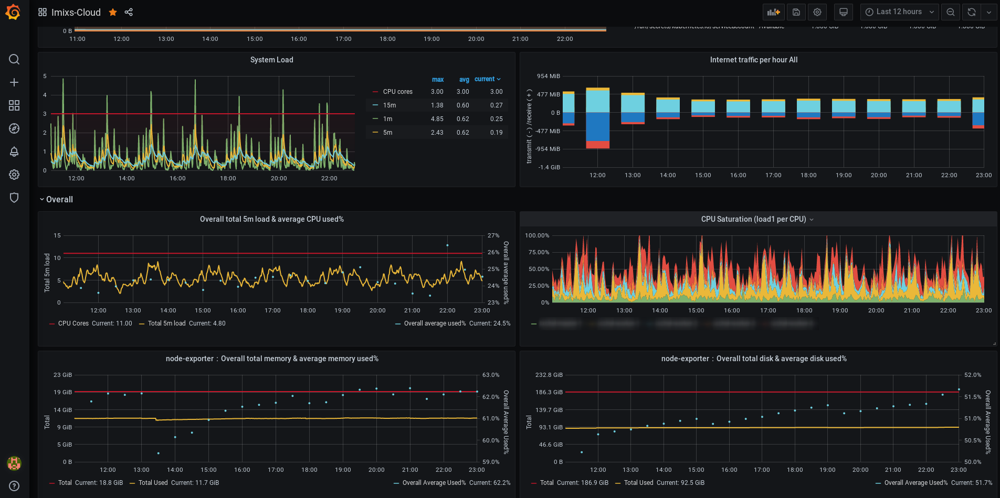

# How to Monitor Imixs-Cloud

*Imixs-Cloud* also provides a monitoring feature which allows you to monitor your Kubernetes cluster.

The *Imixs-Cloud* monitoring is based on the [Prometheus Operator project](https://github.com/prometheus-operator/prometheus-operator).
All metrics collected form the Imixs-Cloud kubernetes cluster can be monitored in a [Grafana](https://grafana.com/) dashboard.

Follow the [Deployment Guide](../management/monitoring/README.md) to setup the monitoring services. 

## The Prometheus Operator

The [Prometheus Operator project](https://github.com/prometheus-operator/prometheus-operator) provides Kubernetes native deployment and management of Prometheus and related monitoring components. The purpose of the project is to simplify and automate the configuration of a Prometheus based monitoring stack for Kubernetes clusters.

## Kube Prometheus

Based on Prometheus Operator the project [kube-prometheus](https://github.com/prometheus-operator/kube-prometheus) provides example configurations for a complete cluster monitoring stack. 
The goal of *kube prometheus* is to simplify the deployment and configuration of Prometheus, Alertmanager, and related monitoring components. 
The *Imixs-Cloud* monitoring is based on the latest version of the *kube-prometheus* so no additional configuration is need here.

## Prometheus

[Prometheus](https://prometheus.io/) is an open-source systems monitoring and alerting toolkit. 
The Prometheus service is the database used for collecting the metric data. The Prometheus server is only internal and not accessible from outside of your cluster. The internal address for data access is:

	http://prometheus-k8s.monitoring.svc:9090

## Grafana

The [Grafana](https://grafana.com/) service is the front-end application used to visualize the data collected by Prometheus. 
The grafana service provides a web interface with rich functionality for monitoring and alerting. 

To access grafana you need ot setup a Ingress route. See the [Deployment Guide](../management/monitoring/README.md) for details.
 
### First Login

For the first login use the userid 'admin' and the password 'admin'. You will be force to change the admin password first.

 
### Setup the Prometheus Database

The prometheus database is automatically configured by *kube prometheus*. You can verify the configuraiton on the grafana configuration page:

You don't need to add or change additional data.

## The Dashboards

The  *kube prometheus*  project provide a large number of Grafana dashboards which can be access from the dashboard configuration page.
You can access the dashboard from the dashbard management plane:

You can also import additional Dashboards as JSON or by a Dashboard id:

Here is a list of usefull dashboards which can be used in Imixs-Cloud monitoring:

 - https://grafana.com/grafana/dashboards/12919
 - https://grafana.com/grafana/dashboards/11074
 - https://grafana.com/grafana/dashboards/8171
 
 