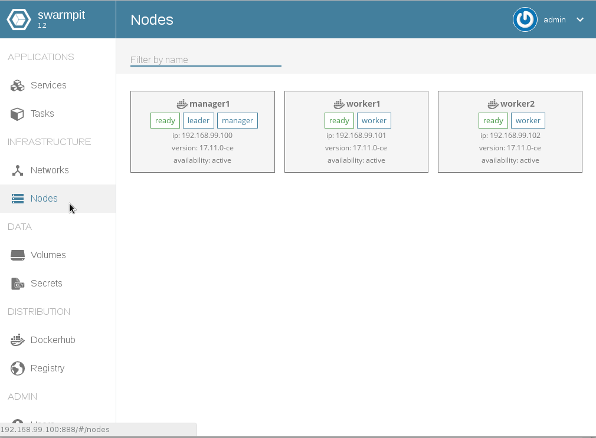

# How to setup the Imixs-Cloud

The following section describes the setup procedure of _Imixs-Cloud_ with [Docker-Swarm](https://docs.docker.com/engine/swarm/) into a productive environment. 

Read the following tutorial for general information about how to setup a Docker-Swarm:

* [Official Docker-Swarm Tutorial](https://docs.docker.com/engine/swarm/swarm-tutorial/)
* [Lightweight Docker Swarm Environment - by Ralph Soika](http://ralph.blog.imixs.com/lightweight-docker-swarm-environment/)
* [How to Run Docker-Swarm on VM Servers - by Ralph Soika](http://ralph.blog.imixs.com/how-to-run-docker-swarm-on-a-vm-servers/)

## Nodes

A _Imixs-Cloud_ consists of a minimum of two nodes.

* The management node is the swarm manager and provides a private registry and a reverse proxy service.
* The worker nodes are serving the applications. 

A node can be a virtual or a hardware node. All nodes are defined by unique fixed IP-addresses and DNS names. Only the manager-node need to be accessible through the internet. All nodes in the swarm must have docker installed and be able to access the manager at the IP address.

### Install Docker

To install docker on a node follow the [official installation guide for Docker CE](https://docs.docker.com/engine/installation/linux/docker-ce/debian/).
If you have unix user to run the docker cli, you have to add the user to the group 'docker'

	adduser username docker
	
### Directories

The management node has the following directory structure located in the manager home directory to setup and run the Imixs-Workflow-Cloud and its services. 

	/-
	 |- management/
	 |   - registry/
	 |   - swarmpit/
	 |   - traefik/
	 |- apps/

The /management/ directory holds the service configuration for the management services running on the management node only. 
The /apps/ directory contains service setups to start applications running on the worker nodes.
	

### Open networks, protocols and ports

The following ports must be available on each node. 

 - TCP port 2377 for cluster management communications
 - TCP and UDP port 7946 for communication among nodes
 - UDP port 4789 for overlay network traffic
 
The following ports will be later published to be accessable from the internet:

 * 80 - The Reverse proxy endpoint 
 * 8100 - The reverse proxy server UI traefik
 * 8200 - The swarm management UI swarmpit
 * 8300 - The imixs private registry

## Init the swarm manager

To setup docker swarm on the management-node run the following command:

	docker swarm init --advertise-addr [manager-ip-address]
	
'manager-ip-address' is the fixed ip address of the manger node to be used by worker nodes. (Typically the main address of the manager-node)

This command init the swarm and returns a pre-configured docker swarm join command for to be executed on any worker-node to joint the swarm. For example: 

	docker swarm join --token SWMTKN-1-xxxxxxxxxxxxxxxxxxxx-xxxxxxxx 192.168.99.100:2377

The IP address given here is the IP from the manager-node.
	
### Join the swarm node 

To join the swarm node from a worker node you can run the command _docker swarm join_ followed by the swarm token. 
To get the join token later run the following command on the manager node:

	docker swarm join-token worker 

Working with VMs, the worker-node has typically a private IPv4 address. As a result the swarm may not run correctly, specially in relation with overlay networks. To solve those problems the public IPv4 address of the worker-node need to be added with the option  _–advertise-addr_ when joining the swarm.

	docker swarm join \
	 --token SWMTKN-1-xxxxxxxxxxxxxxxxxxxx-xxxxxxxx \
	 --advertise-addr [worker-ip-address]\
	 [manager-ip-address]:2377

Where [worker-ip-address] is the public IPv4 address of the worker-node joining the swarm.

To verify the nodes in a swarm run:

	docker node ls
	ID				HOSTNAME 	STATUS 		AVAILABILITY 	MANAGER STATUS
	niskvdwg4k4k1otrrnpzvgbdn * 	manager1	Ready 		Active 		Leader
	c54zgxn45bvogr78qp5q2vq2c 	worker1		Ready 		Active 

To inspect a node in detail to see if the correct IP is given, run:

	docker node inspect worker1

### Create Overlay Networks

The nodes in the Imixs-Cloud  communicate via two different overlay networks:

 * imixs-cloud-network - used for the swarm 
 * imixs-proxy-network - used by the reverse proxy
 
To create the overlay networks on the manager-node run:

	docker network create --driver=overlay imixs-cloud-net
	docker network create --driver=overlay imixs-proxy-net

 
## Docker-Swarm UI

There are two different UIs which can be used to manage a docker-swarm from the browser.

 * [Swarmpit](https://swarmpit.io/)
 * [protainer.io](https://portainer.io/)
 
Both UIs part of the Imixs-Cloud project and pre-configured. But only one of them should be used as both listen on port 8200!

 
 
### Swarmpit 

[swarmpit.io](http://swarmpit.io) ia a lightweight Docker Swarm management UI. It can be started as a service on the manager node. The configuration is defined by docker-compose.yml located in the folder 'swarmpit/'

To start the service on the manager node:

	docker stack deploy -c management/swarmpit/docker-compose.yml swarmpit

Note: It can take some minutes until swarmpit is started.

After swarmpit was installed and started, the front-end can be access on port 8200

http://manager-node.com:8200

The default userid is ‘admin’ with the password ‘admin’.

** Note: ** If you change the network configuration you need to remove and already existing swarmpit service and its volume!

### portainer.io

[protainer.io](https://portainer.io/)  provides a detailed overview of Docker-Swarm cluster and allows you to manage containers, images, networks and volumes. This works also for the cluster worker nods as portainer starts agents on each worker. 

It can be started as a service on the manager node. The configuration is defined by docker-compose.yml located in the folder 'portainer/'

To start the service on the manager node:

	docker stack deploy -c management/portainer/docker-compose.yml portainer

Note: It can take some minutes until swarmpit is started.

The front-end can be access on port 8200

http://manager-node.com:8200

## The HTTP Reverse Proxy – traefik.io

The HTTP reverse proxy is used to hide services from the Internet. In addition the proxy also acts as a load balancer to be used if applications need to be scaled over several nodes.

In _Imixs-Cloud_ [traefik.io](http://traefik.io) is used as the service for a reverse proxy. 
The service uses a separate overlay network to scan for services. A service which should be available through the proxy need to be run in the network 'imixs-proxy-net'. 

Traefik is configured by a docker-compose.yml file and a traefik.toml file  located in the folder 'management/traefik/'

To start the service on the manager node:

	docker stack deploy -c management/traefik/docker-compose.yml proxy
    
    
After traefik is stared you can access the web UI via port 8100

	http://manager-node.com:8100

**Note: **The Traefik configuraiton is done in the traefik.toml file. You can set the logLevel to "DEBUG" if something goes wrong. 

To test the proxy you can start the whoami service:
	
	docker service create \
	    --name whoami1 \
	    --network imixs-proxy-net \
	    --label traefik.port=80 \
	    --label traefik.frontend.rule=Host:whoami.imixs.com \
	    --label traefik.docker.network=imixs-proxy-net \
	    emilevauge/whoami

It is recommended to create a docker-compose file instead of running the container configuration manually. Look at the following example of the corresponding docker-compose.yml file:

	version: '3.1'	
	services:
	 app:
	   image: emilevauge/whoami	   
	   deploy:
	     labels:
	      traefik.port: "80"
	      traefik.frontend.rule: "Host:whoami.your-domain.com"
	      traefik.docker.network: "imixs-proxy-net"	   
	networks:
	   default:
	    external:
	      name:  imixs-proxy-net  

To start the service as a stack: 

	docker stack deploy -c apps/whoami/docker-compose.yml whoami

	
### The Traefik Docker Network	
The label following label is important here:

	traefik.docker.network: "imixs-proxy-net"

If a container is linked to several networks (e.g. a backend network for a database and a frontend network for the reverse proxy), be sure to set the proper network name for the traefik.docker.network (in our case 'imixs-proxy-net') otherwise traefik will randomly pick one (depending on how docker is returning them). This will result in a situation where traefik doesn't find the correct route to the backend service and will end up with a 'Gateway Timeout' message. 
