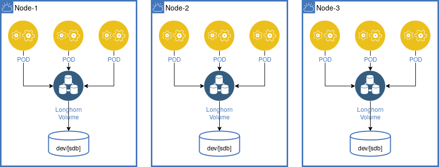
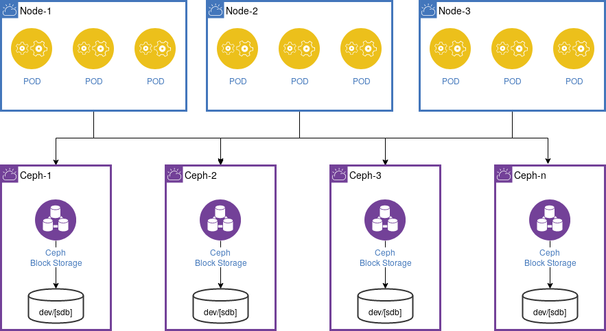

# Storage

To run stateful docker images (e.g. a Database like PostgreSQL) you need to define a storage volume along with your service. In general you have two choices.

 1. Run the service on a dedicated node and use a local volume - this avoids the lost of data as kubernetes will not re-schedule your service to another node with a new local volume
 1. Use a distributed storage solution like [longhorn](https://longhorn.io/) or [ceph](https://ceph.io/) 

Because of the idea to abstract all hardware within your Kubernetes cluster, of course only the second variant is appropriate. A distributed storage solution means that independent of where your application is running the storage will always be available in the same way.  

The *Imixs-Cloud* project supports two distributed storage solutions: [longhorn](https://longhorn.io/) and [ceph](https://ceph.io/). For both you will find setup guides. 

## Longhorn
 
Due to its simplicity and the very good integration in Kubernetes, [Longhorn](https://longhorn.io/) is a perfect storage solution for small environments. The Longhorn storage runs within your worker nodes and will be distributed over all nodes in one cluster. In case your worker nodes have extra large storage devices you can easily connect them to longhorn. 

	

Follow the [Install Guide](LONGHORN.md) to setup longhorn within your kubernetes cluster.

## Ceph

[Ceph](https://ceph.io/) provides an object storage and block device interface and also a traditional file system interface with POSIX semantics. This makes it a powerful storage solution for different scenarios. 

In difference to Longhorn, Ceph can be run on separate nodes which is the recommended setup within a *Imixs-Cloud* environment. Ceph is fully interoperable to Docker. In this way it easy to install as the only thing you need for a node is a server running docker. You can expand your Ceph cluster independent from your Kubernetes environment.

 Follow the [Install Guide](CEPH.md) to setup a ceph cluster to be used from your Kubernetes cluster.

 
 
## Storage Recovery form Crashed Nodes

IN case a worker node in a Kubernetes cluster shuts down or crashes, all pods in a StatefulSet that reside on this node will become unavailable. In these scenarios, the node status is NotReady, and the pod status appears as Terminating. This is one existing limitation of Kubernetes. You can find discussions about this [here](https://github.com/kubernetes/kubernetes/issues/65392) and [here](https://github.com/kubernetes-sigs/sig-storage-local-static-provisioner/issues/181)

The following section details the manual operation required to revive Kubernetes pods that reside on a crashed node. This procedure is independent from the distributed storage solution - [longhorn](https://longhorn.io/) and [ceph](https://ceph.io/) are affected in the same way. 

### Recovering a crashed node

First check the status of your nodes to identify the 'NotReady' node in your cluster:

	$> kubectl get nodes
	NAME STATUS ROLES AGE VERSION
	k8s-master Ready master 6d v1.14.1
	k8s-node1 Ready <none> 6d v1.14.1
	k8s-node3 NotReady <none> 6d v1.14.1

The problem here is that you node maybe still in a running mode but your master node is not able to access it (e.g. because of a network failure). So if possible shutdown the node manually to make sure your worker node is still not processing data in the background. 

....find the volumeattachment of your affected pods:

    $> kubectl get volumeattachment

Next copy the volumeattachment name assigned to your pod and delete the volumeattachment:

    $> kubectl delete volumeattachment <volumeattachment name>

This will normally start the POD on a new worker node automatically because the volumeattachment is now no longer blocked. Verify that the new pod is now in a Running state on a new worker-node.

Finally you can delete the pod:

    $> kubectl delete pod <pod name> --grace-period=0 --force

### Deleting terminatign PVs 

If you can not get rid of this issue you need to manually editing the pv and then removing the finalizers which looked something like this:

e.g

	$ kubectl patch pv pv_name -p '{"metadata":{"finalizers":null}}'

This can alos be done for all existing PVs with a one liner (BE CAREFULL!!!)

	$ kubectl get pv | tail -n+2 | awk '{print $1}' | xargs -I{} kubectl patch pv {} -p '{"metadata":{"finalizers": null}}'

Find details here: https://github.com/kubernetes/kubernetes/issues/77258

