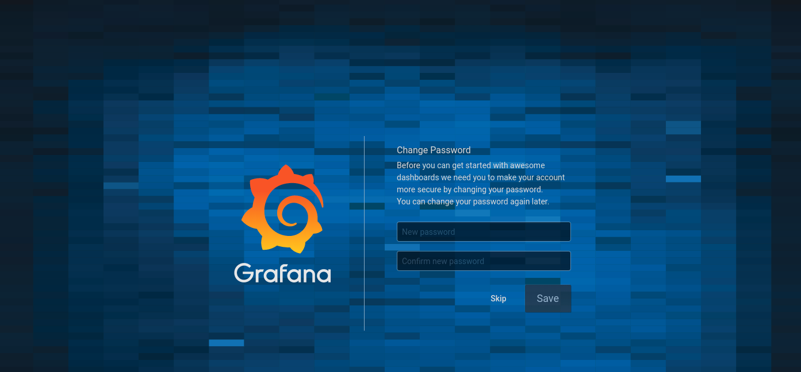
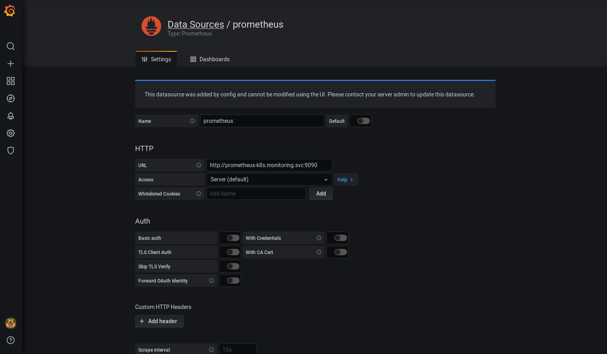
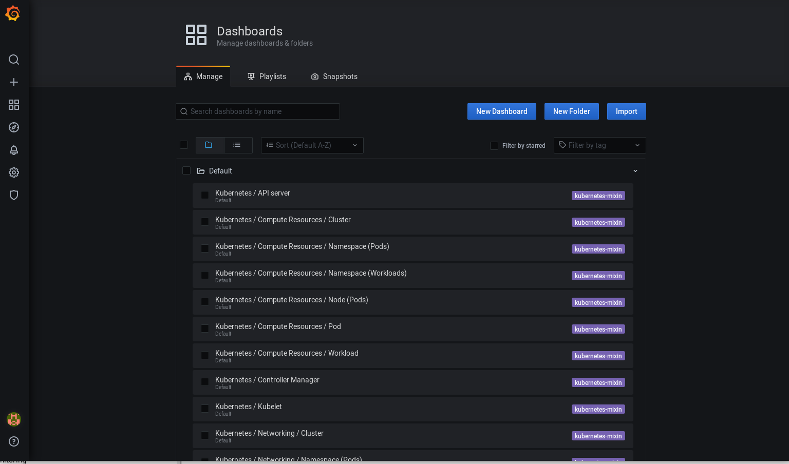
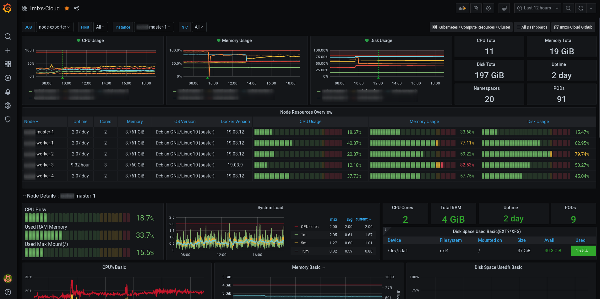

# The Prometheus Operator

The [Prometheus Operator project](https://github.com/prometheus-operator/prometheus-operator) provides Kubernetes native deployment and management of Prometheus and related monitoring components. The purpose of the project is to simplify and automate the configuration of a Prometheus based monitoring stack for Kubernetes clusters.

## Kube Prometheus

Based on Prometheus Operator the project [kube-prometheus](https://github.com/prometheus-operator/kube-prometheus) provides example configurations for a complete cluster monitoring stack. 
The goal of *kube prometheus* is to simplify the deployment and configuration of Prometheus, Alertmanager, and related monitoring components. 
The *Imixs-Cloud* monitoring is based on the latest version of the *kube-prometheus* so no additional configuration is need here.

The internal address for data access the prometheus service is:

	http://prometheus-k8s.monitoring.svc:9090

## Grafana

The [Grafana](https://grafana.com/) service is the front-end application used to visualize the data collected by Prometheus. 
The grafana service provides a web interface with rich functionality for monitoring and alerting. 

To access grafana you need ot setup a Ingress route. See the [Deployment Guide](../management/monitoring/README.md) for details.
 
 
## Deployment

*kube prometheus* is intended to be used as a library. So all you need to do is to checkout the project form github on your master-node.

	
	# Checkout the project form Github
	$ cd
	$ git clone https://github.com/prometheus-operator/kube-prometheus.git
	$ cd kube-prometheus
	# Create the namespace and CRDs, and then wait for them to be availble before creating the remaining resources
	$ kubectl create -f manifests/setup
	$ until kubectl get servicemonitors --all-namespaces ; do date; sleep 1; echo ""; done
	$ kubectl create -f manifests/

kubectl create -f manifests/setup
until kubectl get servicemonitors --all-namespaces ; do date; sleep 1; echo ""; done
kubectl create -f manifests/

### First Login

For the first login use the userid 'admin' and the password 'admin'. You will be force to change the admin password first.

 
### Setup the Prometheus Database

The prometheus database is automatically configured by *kube prometheus*. You can verify the configuraiton on the grafana configuration page:

You don't need to add or change additional data.

## The Dashboards

The  *kube prometheus*  project provide a large number of Grafana dashboards which can be access from the dashboard configuration page.
You can access the dashboard from the dashbard management plane:

You can also import additional Dashboards as JSON or by a Dashboard id:

Here is a list of usefull dashboards which can be used in Imixs-Cloud monitoring:

 - https://grafana.com/grafana/dashboards/12919
 - https://grafana.com/grafana/dashboards/11074
 - https://grafana.com/grafana/dashboards/8171
 
 

## Kustomization

After you have setup *kube prometheus* you can also customize it using the kubectl tool [Kustomize](../../doc/KUSTOMIZE.md).

For that first create a "kustomization.yaml" file like this one:

	namespace: monitoring
	
	bases:
	- ../../../kube-prometheus
	#- https://github.com/prometheus-operator/kube-prometheus
	
	resources:
	- imixs-cloud-ingress.yaml
	
	patchesStrategicMerge:
	- grafana-env.yaml

In this file a new ingres.yaml resource was define and a grafana-env.yaml file to add some custom environment variables to the grafana service:

### Grafana SMTP configuration

With the following *grafana-env.yaml* you can setup you smtp config used within grafana:

*grafana-env.yaml*:

	apiVersion: apps/v1
	kind: Deployment
	metadata:
	  name: grafana
	  namespace: monitoring
	spec:
	  template:
	    spec:
	      containers:
	      - name: grafana
	        env:
	          - name: GF_SMTP_ENABLED
	            value: "true"
	          - name: GF_SMTP_HOST
	            value: "my-mailgateway.kube-system:25"
	          - name: GF_SMTP_FROM_ADDRESS
	            value: "info@foo.com"

To apply the new grafana configuration apply the kustomization configuration and run:

	$ kubectl apply --kustomize ../monitoring/

### Ingress

To access the grafana dashboard from your Internet domain you can use the traefik reverse proxy configured in *Imixs-Cloud*. Just edit the file *imixs-cloud-ingress.yaml* and replace [YOUR-DNS-NAME] whit the name of you monitoring Internet domain name. 

To apply the ingress configuration aplly the kustomization configuration explained above and run:

	$ kubectl apply --kustomize ../monitoring/

## Uninstall

To teardown the stack run:

	$ kubectl delete --ignore-not-found=true -f manifests/ -f manifests/setup